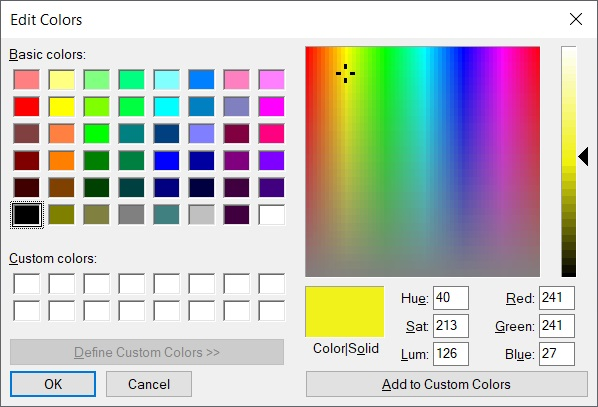

Задавање боја
=============

Избор "готових" боја
--------------------

Са бојама си се у свету рачунара до сада сигурно сусрео/сусрела користећи неки од програма за цртање, као што је рецимо Пеинт (Paint). Ако погледамо опције за боје које овај програм нуди, видећеш да ти нуди могућност да за цртање изабереш неку од боја које су унапред припремљене за тебе. Довољно је да кликнеш на квадратић са бојом из горњег менија и моћи ћеш да је користиш. 

.. image:: ../_images/paint3.jpg
   :align: center
   :width: 700px

|

Исто тако, и Пајгејм ти нуди могућност да користиш различите боје. Све облике можеш цртати у разним бојама, а приметићеш да је често неопходно одредити боју одређеном елементу. Најлакши начин да нешто обојимо у Пајгејму је помоћу функције ``pg.Color``. Ова функција као аргумент има ниску која представља назив боје на енглеском. Посматрај коришћење ове функције као да у Пеинту изаберемо неку од понуђених боја. Разлика је у томе што не кликнемо на квадратић у коме се боја налази, него у програму употребимо функцију и као њен аругмент наведемо име боје. 

.. reveal:: podsetnik_bojе
   :showtitle: Подсетник - ниске и функције
   :hidetitle: Сакриј прозор
   
   .. infonote:: Подсетник
      
      Подсетимо се, ниске се наводе било између једноструких, било између двоструких наводника (равноправно се, на пример, могу користити ``'blue'`` и ``"blue"``). Такође, рекли смо да име боје наводимо као параметар функције  ``pg.Color`` - ако желиш да се подсетиш тога шта су функције и како се наводе параметри функција (оно што стоји у загради), то можеш погледати у `овој лекцији  <https://petlja.org/biblioteka/r/lekcije/prirucnik-python/izracunavanje-cas9>`__ у Приручнику за шести разред. Оно што ће ти за сада бити довољно је да се сетиш да функцији дајемо одређене елементе (зову се аргументи, стоје у загради и могу бити свашта - ниске, варијабле, бројеви, друге функције...), а она онда ради нешто са тим вредностима и враћа нам резултат - на пример, када функцији ``min`` дамо два броја, она ће нам вратити мањи од та два броја (``min(1,4)`` вратиће нам ``1``). 

Ако функцију ``pg.Color`` употребимо са аргументом ``'blue'``, жељени елемент ће бити обојен у плаво, за жуту ћемо употребити ``'yellow'``, за зелену ``'green'`` и слично. Хајде да то сада испробамо. Унеси неку од ових боја уместо три знака питања у програм испод и кликни на 'Покрени програм'. Прво смо употребили функцију ``prozor.fill`` чији је једини параметар боја (Пајтон очекује да се у загради након ``prozor.fill`` нађе нешто што ће му рећи коју боју да употреби) и која боји цео прозор у задату боју (видећеш, ово ће касније бити корисно за цртање позадине). Онда употребљавамо функцију ``pg.Color`` и дајемо јој као аргумент ниску са називом боје. Испробај још неколико различитих боја у програму испод, а на крају лекције налази се листа свих боја које ћемо користити. 

.. activecode:: colors
   :nocodelens:
   :enablecopy:
   :modaloutput:

   # -*- acsection: general-init -*-
   import pygame as pg
   import pygamebg

   # otvaramo prozor
   (sirina, visina) = (400, 400)
   prozor = pygamebg.open_window(sirina, visina, "Boja pozadine")
   # -*- acsection: main -*-

   # bojimo pozadinu prozora
   prozor.fill(pg.Color("???"))
   
   # -*- acsection: after-main -*-
   # prikazujemo prozor i čekamo da ga korisnik isključi
   pygamebg.wait_loop()
         
.. reveal:: napomena_bojе
   :showtitle: Напомена - могуће грешке
   :hidetitle: Сакриј прозор
   
   .. infonote:: Честе грешке
      Једна грешка коју можеш направити приликом задавања боје је да уместо да ``pg.Color`` напишеш великим словом, напишеш ``pg.color`` малим словом. Тада ће ти се приказати грешка ``AttributeError: '' object has no attribute 'color'``. Још једна грешка је да назив боје не наведеш под наводницима (на пример, да наведеш ``pg.Color(white)``). Тада ће ти се приказати порука ``NameError: name 'white' is not defined on line 8``.

Специфичне боје
---------------

Иако су нам боје које смо до сада поменули најчешће довољне, понекад пожелимо да употребимо и неку другу боју или нијансу боје која није понуђена. Када то пожелимо да урадимо у Пеинту, кликнемо на *Edit colors* и отвара се један овакав прозор:

Видећеш да ти је овако доступно много више боја и довољно је да кликнеш у овај квадрат десно у коме су све боје и изабереш тачну нијансу коју желиш. Међутим, када добијеш жељену боју, видећеш и ове бројеве који се појављују доле десно и видећеш да поред њих пише *red*, *green* и *blue*. Погледај шта се дешава са овим бројевима када изабереш неку другу боју. Свакa бојa коју наше око може да види састоји се управо од ове три основне боје. Све боје можемо описати наводећи ова три броја (у овом случају ови бројеви могу имати вредност од 0 до 255), који редом представљају количину црвене, зелене и плаве компоненте у боји коју дефинишемо.

На пример, комбиновањем црвеног и зеленог светла добија се жуто
светло, комбиновањем црвеног и плавог љубичасто, а комбиновањем плаве
и зелене добијамо резедо боју. Комбиновањем светла све три основне боје добија се
бело светло док се црно светло добија када се сва три светла искључе.
Нијансе сиве боје су препознатљиве по томе што је у њима количина црвене, зелене и
плаве једнака (на основу тога можемо сматрати да су црна и бела
екстремно тамна и екстремно светла нијанса сиве).

.. image:: ../_images/RGB.png
   :align: center
   :width: 200px

.. zanimljivost_bojе1
   :showtitle: Занимљивост - мешање боја
   :hidetitle: Сакриј прозор
   
   .. infonote:: Мешање боја
      Ако нам не верујеш зато што си до сада научио/научила да су основне боје плава жута и црвена и да се њиховом комбинацијом добијају све друге боје погледај следећи видео и видећеш да не лажемо. 

      .. ytpopup:: ELJ18NS_B6E
         :width: 735
         :height: 415
         :align: center

      Ствар је у томе што комбиновање светлости одређене боје и комбиновање различитих пигмената, темпера, или штампарске боје на пример, нису иста ствар. При комбиновању светла, основне боје (оне помоћу којих се добијају све остале боје) јесу црвена, зелена и плава, као што си могао/могла да се увериш у претходном видеу, а при комбиновању различитих пигмената начин мешања боја је потпуно другачији процес.

      Да je RGB модел користан и да је мешање боја уистину такво како смо овде написали, може те уверити и то што сви екрани које данас користимо користе управо овај модел боје. Најмањи елемент сваког екрана је пиксел и сви екрани се заправо састоје из великог броја малих светала која могу да буду црвена, зелена или плава. Распоређујући ове боје на одговарајући начин, на екранима се добијају и све остале боје. Погледај следећи видео како би ти ово било јасније. Обрати пажњу на то које су једине три боје тачкица које видиш (пиксела).

      .. ytpopup:: NyUMeSBw3X8
         :width: 735
         :height: 415
         :align: center

У програмском језику Python, као и у Паинту (као и у рачунарству уопште), боју можеш представити и тројком бројева и то у облику трочлане уређене торке (нпр. ``(123, 80, 56)``) или трочлане листе (нпр. ``[123, 80, 56]``). Сети се, када кажемо да је нешто уређено, то значи да је битан редослед елемената - и овде ћемо увек прво наводити компоненту црвене, затим компоненту зелене и на крају компоненту плаве, увек истим редоследом. Торку или листу можеш навести директно као аргумент функције који одговара боји, а можеш је упамтити у променљивој и касније користити више пута.  На пример, доделом ``REZEDO = (0, 255, 255)`` дефинишемо резедo боју (каже се и тиркизна или цијан, а то је у ствари боја светлосне сабље Лука Скајвокера из филма `A New Hope: Star Wars: Episode IV`) наводећи одговарајуће количине црвене, зелене и плаве светлости коју ова боја садржи - пошто је то мешавина плаве и зелене боје у њој нема нимало црвене, а плава и зелена компонента су на максимуму. Након тога, ту боју можемо употребити и у позиву функције (нпр. ``prozor.fill(REZEDO)``). Имена тих променљивих не морају бити написана великим словима, али то је добар обичај.

Све ово ће ти бити јасније када у следећем програму замениш знакове питања бројевима које желиш и кликнеш на `Покрени програм`. Покушај да пронађеш боје о којима смо говорили, а покушај и да унесеш и боје које се налазе у листи на крају лекције. Наравно, обрати пажњу и на то како смо овог пута употребили функцију ``prozor.fill``. Довољно је било јој као аргумент дамо листу три броја и она је знала како да прозор обоји у одговарајућу боју.

.. activecode:: colors_rgb
   :nocodelens:
   :enablecopy:
   :modaloutput:

   # -*- acsection: general-init -*-
   import pygame as pg
   import pygamebg

   # otvaramo prozor
   (sirina, visina) = (400, 400)
   prozor = pygamebg.open_window(sirina, visina, "Боје - RGB")
   # -*- acsection: main -*-

   # bojimo pozadinu prozora
   prozor.fill([???, ???, ???])
   
   # -*- acsection: after-main -*-
   # prikazujemo prozor i čekamo da ga korisnik isključi
   pygamebg.wait_loop()

Наведимо имена основних боја које ћемо користити у нашим програмима.

========================   ============   ============    
   "Готове боје"                               RGB
``pg.Color("red")``        Црвена         ``(255, 0, 0)`` 
``pg.Color("green")``      Зелена         ``(0, 255, 0)`` 
``pg.Color("blue")``       Плава          ``(0, 0, 255)``
``pg.Color("black")``      Црна           ``(0, 0, 0)`` 
``pg.Color("white")``      Бела           ``(255, 255, 255)`` 
``pg.Color("cyan")``       Рeзедо         ``(0,255, 255)``
``pg.Color("magenta")``    Љубичаста      ``(255, 0, 255)``
``pg.Color("yellow")``     Жута           ``(255, 255, 0)``
``pg.Color("orange")``     Наранџаста     ``(255, 128, 0)``
``pg.Color("gray")``       Сива           ``(128, 128, 128)``
========================   ============   ============

Најважније из ове лекције
-------------------------

* Боје у Пајгејму можеш добити тако што ћеш позвати функцију ``pg.Color`` и њој као аргумент проследити ниску са називом боје, на пример ``pg.Color("red")``
* Све боје састоје се од 3 компоненте - црвеног светла, зеленог и плавог и могу се изразити бројем између 0 и 255 који означава присуство једне од ових компоненти
* У Пајтону се боје могу представити као уређене тројке ових вредности ``(255, 0, 0)`` или као листа која садржи ове вредности ``[255, 0, 0]``
* Боје којe сам/сама дефинишеш можеш сместити и у варијаблу коју ћеш касније лако да позовеш. 