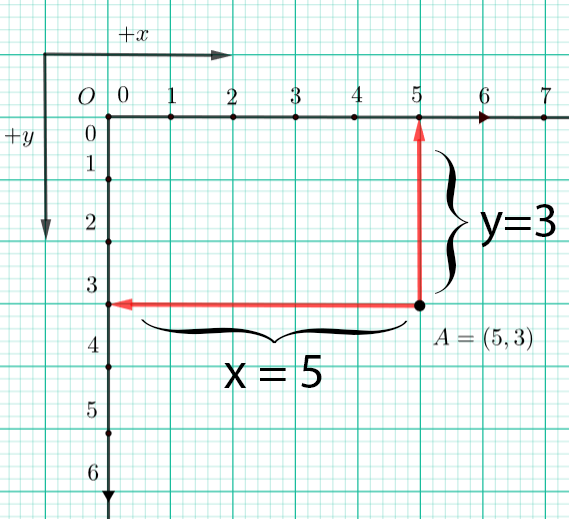

Координатни систем
==================

Координатни систем ти је већ познат из математике, али чим погледаш слику испод, одмах ћеш приметити да је координатни систем који ћемо од сада користити у Пајгејму окренут "наопако". Координатни почетак налази се у горњем левом углу прозора, а не у доњем левом, на шта си можда навикао/навикла радећи математику. Не дозволи да те ово збуни - све функционише потпуно исто као и до сада - и овај координатни систем има и :math:`x` и :math:`y` осу, и овде :math:`x` оса расте са лева на десно, и овде је свака тачка одређена помоћу њених вредности на :math:`x` и :math:`y` оси, једина разлика је то што :math:`y` оса расте одозго на доле, а не одоздо на горе, како је до сада било у математици.

Погледај тачку :math:`A(5, 3)` која се налази доле на слици. Она је од леве ивице екрана удаљена 5 и зато кажемо да је вредност њене :math:`x` координате :math:`5`. Од горње ивице је удаљена 3 и зато кажемо да је вредност њене :math:`y` координате :math:`3`. Положај сваке тачке одређен је уређеним паром ових вредности. Када кажемо да је неки пар уређен, то значи да је у том пару важан **редослед његових елемената**. У нашем случају, за сваку тачку ће се увек прво изразити вредност њене :math:`x` координате, а онда вредност њене :math:`y` координате. 

Ако бисмо подигли тачку :math:`A(5, 3)` за 1 на горе и задржали њену :math:`x` координату, тада би нове координате тачке :math:`A` биле :math:`A(5, 2)`. Ако бисмо тачку :math:`A` са тренутне позиције померили (транслирали) на доле за 2 нове координате би јој биле :math:`A(5, 4)`. Положај свих објеката (тачака, дужи, кругова и слично) на прозору одређује се њиховим координатама у координатом систему прозора. Ово је јако важно зато што ћемо у **дословно сваком програму у коме користимо Пајгејм морати да одређујемо положај одређених објеката у прозору**. 

.. reveal:: napomena_pixel
   :showtitle: Напомена
   :hidetitle: Сакриј прозор
   
   .. infonote:: Напомена
   
      Јединица мере помоћу које ћемо изражавати сва растојања је пиксел. Дужину прозора, дужину линија које цртамо, растојање између елемената у оквиру прозора изражаваћемо у пикселима. 

Наредни програм ће ти олакшати да схватиш координате. Померај миша и
прати пажљиво како се координате мењају. Прозор по ком се миш креће је
димензије 300 пута 300 пискела. У врху прозора пише колико је :math:`x` и
колико је :math:`y`, а изнад миша пише уређен пар координата (у загради су
уписане обе координате и то прво координата :math:`x`, а онда :math:`y`). Покрени
програм дугметом "Прикажи пример". Пробај да пронађеш тачке (0, 0), (150, 150), (150, 10), (280, 10), (10, 150), (280, 150)

.. activecode:: nauci_koordinate
   :nocodelens:
   :modaloutput:
   :playtask:
   :includehsrc: _src/koordinate.py

Најважније из ове лекције
-------------------------

* Положај свих објеката у Пајгејм прозору (линије, облици, слике...) одређен је њиховим координатама у координатном систему.
* Координатни систем Пајгејм прозора разликује се од оног са којим си  се до сада срео/срела само по томе што је :math:`y` оса "наопака" - расте одозго на доле.
* Свака тачка у координатном систему одређена је помоћу два броја - вредности њене :math:`x` координате, а онда њене :math:`y` координате.
* Редослед навођења ових координата је увек исти - прво се наводи :math:`x`, а онда :math:`y` координата (пар бројева који увек имају исти редослед назива се уређеним паром)

