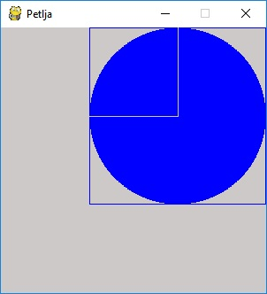
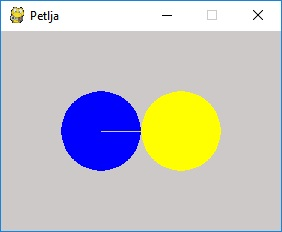

Координатни систем - квиз
=========================

Провери своје познавање координатног система тако што ћеш одговорити на следећа питања

Питање 1.
~~~~~~~~~

У PyGame прозору величине 250 x 250 тачка (0, 250) се налази у

.. mchoice:: korner
    :answer_a: горњем левом углу прозора,
    :feedback_a: Нетачно    
    :answer_b: доњем десном углу прозора,
    :feedback_b: Нетачно    
    :answer_c: доњем левом углу прозора,
    :feedback_c: Тачно
    :answer_d: горњем десном углу прозора.
    :feedback_d: Нетачно    
    :correct: c
    
    Изабери тачан одговор:

Питање 2.
~~~~~~~~~

Које ће бити нове координате тачке T(250, 300) уколико се она помери за 80 пиксела на доле?

.. mchoice:: tacke3
    :answer_a: (250, 220)
    :feedback_a: Нетачно    
    :answer_b: (250, 380)
    :feedback_b: Тачно
    :answer_c: (170, 300)
    :feedback_c: Нетачно    
    :answer_d: (330, 300)
    :feedback_d: Нетачно    
    :correct: b
    
    Изабери тачан одговор:

Питање 3.
~~~~~~~~~

Нека је прозор димензија 450 x 450, а страница квадрата нацртаног у прозору 300 x 300. Које су координате центра круга који је уписан у квадрат?

.. mchoice:: kvadrat_krug
    :answer_a: (150, 150)
    :feedback_a: Нетачно    
    :answer_b: (300, 150)
    :feedback_b: Тачно
    :answer_c: (150, 300)
    :feedback_c: Нетачно    
    :answer_d: (300, 300)
    :feedback_d: Нетачно    
    :answer_e: Ниједан од осталих понуђених одговора није тачан.    
    :feedback_e: Нетачно    
    :correct: b
    
    Изабери тачан одговор:

Питање 4.
~~~~~~~~~~~

Чему је једнака дужина дужи АB, где је А(10, 70) и B(40, 110)?

.. mchoice:: tacke7
    :answer_a: 50
    :feedback_a: Тачно
    :answer_b: 30
    :feedback_b: Нетачно    
    :answer_c: 70
    :feedback_c: Нетачно    
    :answer_d: 40
    :feedback_d: Нетачно    
    :correct: a
    
    Изабери тачан одговор:

Питање 5.
~~~~~~~~~~~

Нека су (150, 150) и (250, 350) редом координате тачака A и B у PyGame прозору. Које су координате тачке C која представља средиште дужи AB?

.. mchoice:: tacke4xy
    :answer_a: (150, 350)
    :feedback_a: Нетачно    
    :answer_b: (150, 250)
    :feedback_b: Нетачно    
    :answer_c: (200, 350)
    :feedback_c: Нетачно    
    :answer_d: (200, 250)
    :feedback_d: Тачно
    :answer_e: Ниједан од осталих понуђених одговора није тачан.
    :feedback_e: Нетачно    
    :correct: d
    
    Изабери тачан одговор:

Питање 6.
~~~~~~~~~

У прозору димензија 300 x 200 најмања могућа вредност X координате је 

.. mchoice:: minx
    :answer_a: -300
    :feedback_a: Нетачно    
    :answer_b: -200
    :feedback_b: Нетачно    
    :answer_c: 300
    :feedback_c: Нетачно    
    :answer_d: 0
    :feedback_d: Тачно
    :answer_e: 200
    :feedback_e: Нетачно    
    :correct: d
    
    Изабери тачан одговор:

Питање 7.
~~~~~~~~~

Чему је једнака дужина дужи АB, где је А(40,60) и B(40,80)?

.. mchoice:: tacke2
    :answer_a: 0
    :feedback_a: Нетачно    
    :answer_b: 20
    :feedback_b: Тачно
    :answer_c: 40
    :feedback_c: Нетачно    
    :answer_d: 60
    :feedback_d: Нетачно    
    :answer_e: Ниједан од осталих понуђених одговора није тачан.
    :feedback_e: Нетачно    
    :correct: b
    
    Изабери тачан одговор:

Питање 8.
~~~~~~~~~  

.. mchoice:: pygame_quiz_koordinate_rast
   :multiple_answers:
   :answer_a: Координата :math:`x` расте слева надесно.
   :answer_b: Координата :math:`y` опада од врха ка дну екрана.
   :answer_c: Тачке на горњој ивици екрана имају координату :math:`y` једнаку 0.
   :answer_d: Тачке на десној ивици екрана имају координату :math:`y` једнаку 0.
   :answer_e: Тачка у доњем десном углу екрана има највеће обе координате. 
   :correct: a, c, e
   :feedback_a: Тачно.
   :feedback_b: Координата :math:`y` расте од врха ка дну екрана.
   :feedback_c: Тачно.
   :feedback_d: Тачке на десној ивици екрана имају највећу :math:`y` координату.
   :feedback_e: Тачно.

   Означи тачна тврђења.

Питање 9.
~~~~~~~~~

Погледај слику. Нека је центар левог (плавог) круга у тачки (60, 20) и нека му је полупречник једнак 10. Чему су једнаке координате центра десног (жутог) круга, који додирује плави круг и има полупречник једнак 10?

.. mchoice:: tacke8
    :answer_a: (70, 30)
    :feedback_a: Нетачно    
    :answer_b: (70, 20)
    :feedback_b: Нетачно    
    :answer_c: (80, 40)
    :feedback_c: Нетачно    
    :answer_d: (60, 40)
    :feedback_d: Нетачно    
    :answer_e: Ниједан од осталих понуђених одговора није тачан.
    :feedback_e: Тачно
    :correct: e
    
    Изабери тачан одговор:

Питање 10.
~~~~~~~~~~

Ако је прозор ширине 200 и висине 300 пиксела, које су координате његове централне тачке (резултат напиши у облику уређеног пара)?

.. mchoice:: tacke9
    :answer_a: (100, 150)
    :feedback_a: Тачно    
    :answer_b: (200, 150)
    :feedback_b: Нетачно    
    :answer_c: (0, 0)
    :feedback_c: Нетачно    
    :answer_d: (150, 150)
    :feedback_d: Нетачно    
    :correct: a
    
    Изабери тачан одговор: