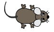

13.1. Пајтон подсетник - гранање
================================

Као што сигурно знаш, у програмирању је могуће учинити да се одређене наредбе извршавају само ако је
неки услов испуњен. Да би се описало условно извршавање неких наредби,
користи се наредба ``if``. У Пајтону она има следећи облик:

.. activecode:: if_синтакса
   :passivecode: true

   if uslov:           # ако је услов испуњен:
       naredba_1       #     изврши наредбу 1
       ...             #     ...
       naredba_k       #     изврши наредбу k

.. infonote::      
    Подсетимо се да се након услова обавезно мора навести двотачка
    (карактер ``:``) и да се наредбе које се извршавају условно морају
    мало увући.
      
Често се јавља и потреба да се у зависности од тога да ли је услов
испуњен изврши једна или друга група наредби. На пример, ако је
корисник унео исправну лозинку, треба му пожелети добродошлицу на сајт,
а у супротном му треба јавити да унета лозинка није исправна. Такав
облик организације извршавања програма се постиже наредбом ``if-else``
која у језику Python има следећи облик:

.. activecode:: if_else_синтакса
   :passivecode: true

   if uslov:        # ако је услов испуњен: 
       naredba_1    #   изврши наредбу 1
       ...          #   ...
       naredba_m    #   изврши наребу m
   else:            # у супротном: 
       naredba_1    #   изврши наредбу 1
       ...          #   ...
       naredba_n    #   изврши наредбу n
      
Приметимо да су оба блока наредби увучена и да је двотачку потребно навести и иза ``else``.

Наредбом ``if-else`` ток програма се раздваја на две могућности (могу
се извршити наредбе испод ``if`` или испод ``else``), па се каже да се
ток програма на том месту **грана**, а наредба ``if-else`` назива се
наредба гранања.

Поређење (релацијски оператори)
-------------------------------
      
Најједноставнији облик услова је поређење неких величина. Рачунар уме
да пореди величине (бројеве, али и ниске). За то се користе оператори
слични онима које сте већ видели у математици:

- ``a < b`` проверава да ли је ``a`` мање од ``b``
- ``a > b`` проверава да ли је ``a`` веће од ``b``
- ``a >= b`` проверава да ли је ``a`` веће или једнако ``b``
- ``a <= b`` проверава да ли је ``a`` мање или једнако ``b``
- ``a == b`` проверава да ли је ``a`` једнако ``b``
- ``a != b`` проверава да ли је ``a`` различито од ``b``

Резултат примене ових операција је *тачно* или *нетачно* (кажемо да је
резултат логичка тј. истинитосна вредност).

.. questionnote::
    Напиши програм који садржи логичку променљиву која се зове *kvadrat* постављену на *True* или *False*.
    У зависности од њене вредности у центру екрана се црта квадрат (за вредност *True*), а за вредност 
    *False* у центру екрана се црта круг.

.. activecode:: if_kvadrat
   :nocodelens:
   :modaloutput: 
   :enablecopy:
   :playtask:
   :includexsrc: _includes/if_kvadrat.py

   prozor.fill(pg.Color("yellow")) # bojimo pozadinu prozora u žuto

   kvadrat = ??? # Upiši ovde True pa pokreni, a zatim False pa ponovo pokreni

   if kvadrat:
       pg.draw.rect(prozor, pg.Color("blue"), (100, 100, 100, 100), 3)
   else:
       pg.draw.circle(prozor, pg.Color("blue"), (150, 150), 50, 3)

.. questionnote::
    Напиши програм који садржи логичку променљиву која се зове *pun_krug* постављену на *True* или *False*.
    У зависности од њене вредности у центру екрана се црта обојен круг (за вредност *True*) или само кружница
    (за вредност *False*).

.. activecode:: if_krug
   :nocodelens:
   :modaloutput: 
   :enablecopy:
   :playtask:
   :includexsrc: _includes/if_krug.py

   # bojimo pozadinu prozora u belo
   prozor.fill(pg.Color("white"))

   pun_krug = ??? # Upiši ovde True pa pokreni, a zatim False pa ponovo pokreni

   if pun_krug:
       pg.draw.circle(prozor, pg.Color("blue"), (150, 150), 50)
   else:
       pg.draw.circle(prozor, pg.Color("blue"), (150, 150), 50, 3)

.. questionnote::
    Напиши програм који садржи логичку променљиву која се зове *macka* постављену на *True* или *False*.
    У зависности од њене вредности у центру екрана се црта мачка (за вредност *True*) а за вредност 
    *False* у центру екрана се црта миш.

.. activecode:: if_macka
   :nocodelens:
   :modaloutput: 
   :enablecopy:
   :playtask:
   :includexsrc: _includes/if_macka.py

   prozor.fill(pg.Color("green"))

   macka = ??? # Upiši ovde True pa pokreni, a zatim False pa ponovo pokreni

   if macka:
       slika = pg.image.load("macka.png")
       prozor.blit(slika,(150 - slika.get_width()//2, 150 - slika.get_height()//2))
   else:
       slika = pg.image.load("mouse.png")
       prozor.blit(slika,(150 - slika.get_width()//2, 150 - slika.get_height()//2))

.. suggestionnote::

   Не заборави да током рада можеш користити и наш `Синтаксни подсетник за Пајтон <https://petljamediastorage.blob.core.windows.net/root/Media/Default/Help/cheatsheet.pdf>`__ ако ти икад затреба да се подсетиш ових ствари.
   Ако желиш, гранања можеш се подсетити у курсу 
   `Програмирање у Пајтону за шести разред <https://petlja.org/kurs/368/11/5597>`__ 
