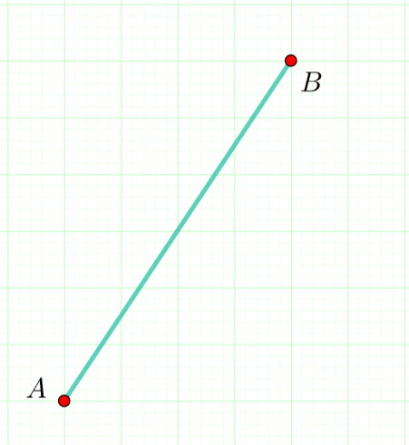
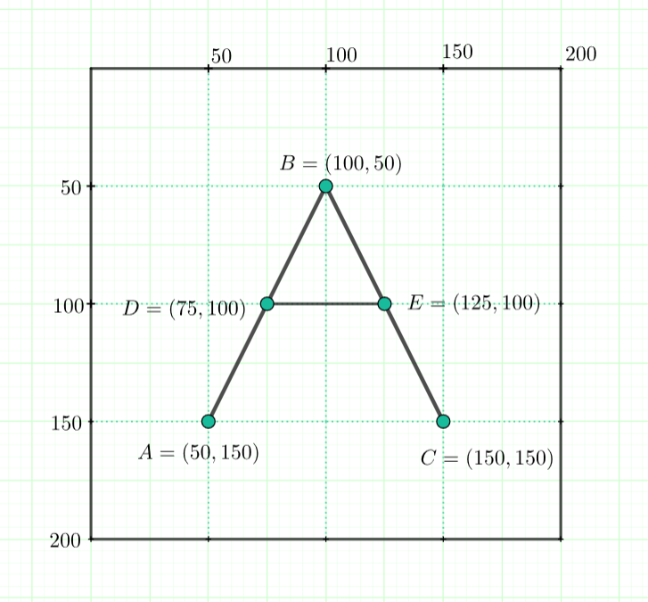

4.1. Дужи
=========

.. infonote::
   Све функције за цртање у библиотеци Pygame почињу са ``pg.draw``.

Дуж :math:`AB` се црта позивом функције ``pg.draw.line``. Позив ове функције изгледа овако: 
``pg.draw.line(prozor, boja, (А_x, А_y), (B_x, B_y), debljina)``. 
Први параметар је прозор на коме желимо да нацртамо дуж (увек ћемо га називати баш ``prozor``). 
Други параметар је боја дужи, а у прошлом делу си научио/научила како се наводи боја. 
Следе почетна и крајња тачка (:math:`A` и :math:`B`) чије координате треба да унесеш у облику 
уређених 
парова (прво иде координата :math:`x` , a затим координата :math:`y`). 
Последњи параметар је дебљина линије којом се исцртава дуж, задата у пикселима. 

Пример једног позивa функције изгледао би овако: 
   
``pg.draw.line(prozor, pg.Color("black"), (100, 100), (300, 300), 5)``

.. questionnote::
   Редослед аргумената наведених у позиву функције је важан! Провери да ли тај редослед знаш.

   1) координате почетне тачке

   2) дебљина линије

   3) прозор

   4) координате крајње тачке

   5) боја

   Сложи аргументе према правилном редоследу:

   (Наведи редне бројеве аргумената према редоследу којим се аргументи морају навести, на пример 12435)

.. fillintheblank:: redosled

   Одговор: |blank|

   - :^\s*35142\s*$: Тачно
     :x: Одговор није тачан.

           
Провежбајмо сада цртање дужи кроз неколико задатака. Ови задаци ће ти
помоћи да боље упознаш координатни систем који користимо за
позиционирање тачака на прозору.

Слово А
'''''''

.. questionnote::

   Напиши програм који помоћу три дужи исцртава слово *A*.

За цртање слова :math:`A` потребно је исцртати три дужи (леву
косу линију, десну косу линију и хоризонталну црту). Величина прозора
је :math:`200` x :math:`200` и о овоме би требало водити рачуна приликом
одређивања координата тачака које представљају темена дужи. Спајањем
одговарајућих тачака, формирају се дужи.

.. infonote::
   Приметимо да смо у решењу увели променљиву ``debljina`` да бисмо
   дебљину све три линије могли да контролишемо само на једном месту.  Ова
   променљива је постављена (иницијализована) на почетку на 10 (наредбом
   доделе ``debljina = 10``) и променом вредности ове променљиве мења се
   дебљина све три дужи које чине наше слово. И у наредним програмима
   ћемо уводити помоћне променљиве које ће нам помоћи да лакше пишемо и
   прилагођавамо наше програме.

  

На слици можеш видети координате тачака. Тачка :math:`A` је од координатног
почетка удаљена :math:`50` пиксела по оси :math:`x` и :math:`150` пиксела 
по оси :math:`y`, зато су координате тачке :math:`A` :math:`= (50, 150)`. На
исти начин ћеш одредити координате осталих тачака.  Упиши их у програм
уместо упитника, а затим покрени програм и провери да ли се добија
слово *А* (једну линију смо већ уцртали).

.. activecode:: slovoA
   :nocodelens:
   :modaloutput: 
   :playtask:
   :includexsrc: _includes/slovo_A.py

   # bojimo pozadinu prozora u sivo
   prozor.fill(pg.Color("gray"))
    
   # debljina linije
   debljina = 10
   # leva kosa linija
   pg.draw.line(prozor, pg.Color("white"), (50, 150), (100, 50), debljina)
   # desna kosa linija
   pg.draw.line(prozor, pg.Color("white"), ???, ???, debljina)
   # horizontalna linija po sredini
   pg.draw.line(prozor, pg.Color("white"), ???, ???, debljina)      

Плус
''''

.. questionnote::

   Напиши програм који исцртава симбол плус у центру прозора димензије
   200x200 пиксела. Симбол се састоји од једне хоризонталне и једне
   вертикалне дужи дужине 100 пиксела и дебљине 10 пиксела.

У решењу је већ нацртана вертикална дуж, а твој задатак је да нацрташ хоризонталну дуж
дужине 100 пиксела, зато добро промисли где ћеш поставити почетну,
односно крајњу тачку дужи. Ширина и висина прозора су 200 пиксела. Анализирај позив функције
``pg.draw.line(prozor, pg.Color("black"), (100, 50), (100, 150), debljina)`` и мало га прилагоди. 

.. infonote::
   Видиш да је на месту аргумента за боју наведен позив функције ``pg.Color("black")`` који враћа црну
   боју. Координате темена вертикалне дужи су ``(100, 50)`` и ``(100, 150)``. Код хоризонталне дужи :math:`y` 
   координата треба да буде одређена тако да се дуж налази на средини прозора по висини, док се :math:`x` 
   координата простире од четвртине, па до три четвртине ширине прозора.
   
.. activecode:: plus
   :nocodelens:
   :modaloutput: 
   :playtask:
   :includexsrc: _includes/simbol_plus.py
      
   # bojimo pozadinu u belo
   prozor.fill(pg.Color("white"))
   # debljina linija je 10 piksela
   debljina = 10
   # vertikalna crna linija dužine 100 piksela
   pg.draw.line(prozor, pg.Color("black"), (100, 50), (100, 150), debljina)
   # horizontalna crna linija dužine 100 piksela
   pg.draw.line(prozor, pg.Color("black"), (???, ???), (???, ???), debljina)
      
.. reveal:: plus_resenje
   :showtitle: Прикажи решење
   :hidetitle: Сакриј решење

   Потребно је да направиш позив ``pg.draw.line(prozor,
   pg.Color("black"), (50, 100), (150, 100), debljina)``.

   
Обојени плус
''''''''''''

.. questionnote::

   Хајде да бојимо! Применимо боје на претходни пример тако да позадина буде жуте боје,
   хоризонтална линија црвене, а вертикална плаве.

У решењу примени задавање боја како смо то радили у лекцији *Боје*. Овај пут потребно је и да самостално
унесеш све параметре функције за цртање линије.
   
.. activecode:: obojeni_plus
   :nocodelens:
   :modaloutput: 
   :playtask:
   :includexsrc: _includes/simbol_plus_boje.py

   # bojimo pozadinu u žuto
   prozor.fill(???)
   # debljina linija je 10 piksela
   debljina = 10
   # vertikalna plava linija dužine 100 piksela
   pg.draw.line(???)
   # horizontalna crvena linija dužine 100 piksela
   pg.draw.line(???)
   
.. reveal:: obojeni_plus_resenje
   :showtitle: Прикажи два решења
   :hidetitle: Сакриј решење

   **Решење 1:** Боје можемо навести помоћу имена.
	       
   .. activecode:: obojeni_plus_resenje_kod
      :passivecode: true
		   
      # bojimo pozadinu u žuto
      prozor.fill(pg.Color("yellow"))
      # debljina linija je 10 piksela
      debljina = 10
      # vertikalna plava linija dužine 100 piksela
      pg.draw.line(prozor, pg.Color("blue"), (100, 50), (100, 150), debljina)
      # horizontalna crvena linija dužine 100 piksela
      pg.draw.line(prozor, pg.Color("red"), (50, 100), (150, 100), debljina)

   **Решење 2:** Боје можемо навести помоћу и помоћу система RGB.
      
   .. activecode:: obojeni_plus_resenje_rgb_kod
      :passivecode: true
		   
      # bojimo pozadinu u žuto
      prozor.fill([255, 255, 0])
      # debljina linija je 10 piksela
      debljina = 10
      # vertikalna plava linija dužine 100 piksela
      pg.draw.line(prozor, [0, 0, 255], (100, 50), (100, 150), debljina)
      # horizontalna crvena linija dužine 100 piksela
      pg.draw.line(prozor, [255, 0, 0], (50, 100), (150, 100), debljina)

.. topic:: Погледај видео:

   Погледај овај видео како би утврдио/утврдила све што о чему смо говорили у овој лекцији.

    .. ytpopup:: 1Wl6yt0dKhA
        :width: 735
        :height: 415
        :align: center 

Најважније из ове лекције
-------------------------

* Позив функције за цртање дужи у општем облику изгледа овако:

   ``pg.draw.line(prozor, boja, (А_x, А_y), (B_x, B_y), debljina)``.

* Дебљина линије је последњи аргумент и он може бити изостављен.
