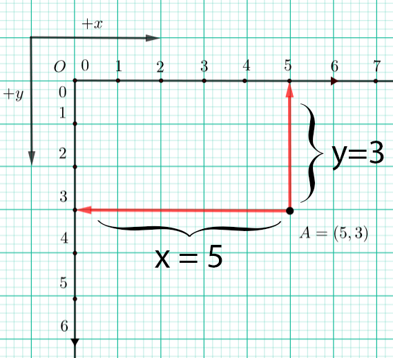

2.2. Координатни систем
=======================

Координатни систем ти је већ познат из математике, али чим погледаш слику испод, одмах ћеш приметити да је координатни 
систем који ћемо од сада користити у Пајгејму окренут „наопако“. Координатни почетак налази се у горњем левом углу 
прозора, а не у доњем левом, на шта си можда навикао/навикла радећи математику. Не дозволи да те ово збуни - 
све функционише потпуно исто као и до сада - и овај координатни систем има и :math:`x` и :math:`y` осу, и овде је 
свака тачка одређена помоћу њених координата :math:`x` и :math:`y`, и овде :math:`x` координате расту са лева на десно, 
једина разлика је то што :math:`y` координате расту одозго на доле, а не одоздо на горе, како је уобичајено у 
математици.

.. infonote::
   Добра страна је што ћемо за разлику од математике радити само са позитивним координатама. Унутар прозора све тачке 
   имају позитивне координате, а остале нам нису интересантне јер су ионако ван прозора!

Погледај тачку :math:`A(5, 3)` која се налази доле на слици. Она је од леве ивице прозора удаљена 5 и зато 
кажемо да је вредност њене :math:`x` координате :math:`5`. Од горње ивице је удаљена 3 и зато кажемо да је 
вредност њене :math:`y` координате :math:`3`. Положај сваке тачке одређен је уређеним паром оваквих координата. 
Када кажемо да је неки пар уређен, то значи да је у том пару важан **редослед његових елемената**. 
У нашем случају, за сваку тачку ће се увек прво изразити вредност њене :math:`x` координате, а онда вредност 
њене :math:`y` координате. 

Ако бисмо подигли тачку :math:`A` за 1 на горе и притом задржали њену :math:`x` координату, тада би нове координате 
тачке :math:`A` биле :math:`A(5, 2)`. Ако бисмо тачку :math:`A` са тренутне позиције померили (транслирали) на доле за 2, 
нове координате би јој биле :math:`A(5, 4)`. Положај свих објеката (тачака, дужи, кругова и слично) у прозору одређује 
се њиховим координатама у координатном систему прозора. Ово је јако важно зато што ћемо у **дословно сваком програму у 
коме користимо Пајгејм морати да одређујемо положај одређених објеката у прозору**. 

.. infonote:: Напомена
   
   Јединица мере помоћу које ћемо изражавати сва растојања је пиксел. Дужину прозора, дужину линија које цртамо, растојање између елемената у оквиру прозора изражаваћемо у пикселима. 

Наредни програм ће ти олакшати да схватиш координате. Померај миша и
прати пажљиво како се координате мењају. Прозор по ком се миш креће је
димензије 300 пута 300 пиксела. У врху прозора пише колико је :math:`x` и
колико је :math:`y`, а поред миша су написане координате као уређен пар (у загради су
уписане обе координате и то прво координата :math:`x`, а онда :math:`y`). Покрени
програм дугметом „Прикажи пример“. Пробај да пронађеш тачке (0, 0), (150, 150), (150, 10), (280, 10), 
(10, 150), (280, 150).

.. activecode:: nauci_koordinate
   :nocodelens:
   :modaloutput:
   :playtask:
   :includehsrc: _includes/koordinate.py

.. topic:: Погледај видео:

   Погледај овај видео како би утврдио/утврдила своје разумевање координатног система у Пајгејму.

    .. ytpopup:: osqRhn3LAx8
        :width: 735
        :height: 415
        :align: center 

Најважније из ове лекције:
--------------------------

* Положај свих објеката у Пајгејм прозору (линије, облици, слике...) одређен је њиховим координатама у координатном систему.
* Координатни систем Пајгејм прозора разликује се од оног са којим си се до сада срео/срела само по томе што је :math:`y` оса  „наопака“ - координате расту одозго на доле.
* Свака тачка у координатном систему одређена је помоћу два броја - вредности њене :math:`x` координате, а онда њене :math:`y` координате.
* Редослед навођења ових координата је увек исти - прво се наводи :math:`x`, а онда :math:`y` координата (пар бројева који увек имају исти редослед назива се уређеним паром).

