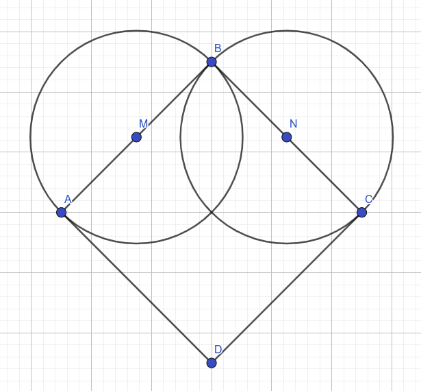

6.2. Цртање облика - многоуглови (каже се и *полигони*)
=======================================================

Троугао се може нацртати помоћу три појединачне дужи. На сличан начин
можемо нацртати и било који други многоугао (полигон). Међутим, ако се
многоуглови цртају на тај начин, они се не сматрају као целина и не
могу, на пример, бити попуњени. Библиотека PyGame даје могућност и за
директно цртање многоуглова.

Многоугао се црта функцијом ``pg.draw.polygon`` чији су параметри
редом:

- прозор на ком се црта,
- боја,
- листа уређених парова који представљају координате темена многоугла
  (она се обично наводи у облику ``[(x1, y1), (x2, y2), ..., (xn,
  yn)]``).

.. infonote::
   Многоугао се састоји од дужи које спајају суседна темена (тачке) у наведеној
   листи. Подразумева се да је многоугао затворен, тј. да многоугао
   садржи и линију између последњег и првог темена. Као и до сада, ако се иза листе
   темена наведе дебљина, црта се само ивица многоугла, а ако се тај
   аргумент изостави или се наведе нула, онда се многоугао испуњава
   бојом.

Размотримо наредни пример.

.. activecode:: mnogougao
   :passivecode: onlymain
   :autorun:
   :includesrc: _includes/mnogougao.py
		
   Многоугао
   ~~~~

Кућицу смо нацртали као црвени испуњен многоугао, а затим смо њен
оквир нацртали као црну многоугаону линију дебљине 3 пиксела. Да не
бисмо исту листу координата наводили два пута, увели смо променљиву
``temena``.
   
Увежбај цртање многоуглова тако што ћеш решити наредних неколико
задатака.

Срце
''''

.. questionnote::

   Напиши програм који исцртава црвено срце.

Срце можемо нацртати и помоћу једног квадрата и два круга.

           
Претпоставимо да се центар квадрата (тачка :math:`О`) налази у центру прозора
(координате су јој :math:`(100, 100)`) и претпоставимо да су висина и ширина
квадрата (заправо његове дијагонале) једнаке 100 пиксела. На основу
тога можеш једноставно израчунати положаје темена квадрата (нпр. тачка
A има координате :math:`(50, 100)`). Пошто квадрат није постављен тако да му
странице буду паралелне осама, не можемо га цртати помоћу
``pg.draw.rect``, али можемо помоћу ``pg.draw.polygon``. Центри кругова се
налазе на средиштима страница квадрата. Координате средишта дужи су једнаке 
аритметичким срединама одговарајућих координата крајева (ово можете да докажете
ако посматрате правоугли троугао коме је дата дуж хипотенуза, а катете су 
паралелне коодинатним осама). На основу реченог лако можемо одредити координате 
центара (на пример, координате тачке :math:`M` су :math:`(75, 75)`). На крају
остаје да се одреди полупречник круга. То можемо урадити
експериментално (тако што испробавамо разне вредности све док не
добијемо задовољавајућу слику). Међутим, много је боље применити знање
из математике и полупречник израчунати. Означимо полупречник круга, страницу 
квадрата и дијагоналу квадрата редом са :math:`r, a, d`. Овде је 
:math:`r = {a \over 2}`, а, пошто је :math:`a = {d \over \sqrt{2}}`, следи да је 
:math:`r = \frac{d}{2 \sqrt{2}} = \frac{d}{4} \sqrt{2}~`. Дужина дијагонале је 
100 пиксела, па је зато полупречник :math:`25 \sqrt{2}`, што је око 35 пиксела.

.. activecode:: srce_crtanje
   :nocodelens:
   :modaloutput: 
   :enablecopy:
   :playtask:
   :includexsrc: _includes/srce-ex1.py

   # kvadrat
   pg.draw.polygon(prozor, pg.Color("red"),
                   [(50, 100), (???, ???), (???, ???), (???, ???)])
   # levi krug
   pg.draw.circle(prozor, pg.Color("red"), (75, 75), ???)
   # desni krug
   ???

Новогодишња јелка
'''''''''''''''''

.. questionnote::

   Напиши програм који исцртава новогодишњу јелку. Потребне координате можеш да очиташ када покренеш пример и позиционираш миша на тачку која те интересује.

.. activecode:: jelka
   :nocodelens:
   :modaloutput: 
   :enablecopy:
   :playtask:
   :includexsrc: _includes/jelka_pomoc.py
   
   # bojimo pozadinu u belo
   prozor.fill(pg.Color("white"))

   # boje koje cemo koristiti
   ZELENA = (0, 100, 36)
   BRAON = (97, 26, 9)

   # krošnja
   pg.draw.polygon(prozor, ZELENA, [(50, 250), (150, 150), (250, 250)])
   pg.draw.polygon(prozor, ZELENA, [(75, ???), (150, 100), (???, 200)])
   pg.draw.polygon(prozor, ???, [(100, 150), (???, ???), (200, ???)])
   # stablo
   ???

Споји тачке
'''''''''''

.. questionnote::

   У низу ``tacke`` дата су темена многоугла. Нацртај тај многоугао на
   позадини боје ``darkgreen``, попуњен бојом ``khaki``. Шта
   представља многоугао који цртамо?

.. activecode:: PyGame_giraffe
   :nocodelens:
   :enablecopy:
   :modaloutput:
   :includexsrc: _includes/zirafa.py

   tacke = [(40, 208), (40, 107), (88, 82), (134, 13), (128, 9), (134, 13), 
      (137, 11), (128, 6), (160, 25), (159, 28), (136, 28), (98, 101),
      (100, 106), (101, 207), (97, 207), (95, 164), (83, 121), (85, 128),
      (54, 128), (55, 119), (44, 165), (44, 208)]
   # bojimo pozadinu prozora u tamno zeleno
   # crtamo mnogougao na osnovu datih tačака

.. topic:: Погледај видео:

   Погледај овај видео, научи и провежбај како да кругове и многоуглове црташ и на свом рачунару.

    .. ytpopup:: 8xs-4k3avOI
        :width: 735
        :height: 415
        :align: center 

Најважније из ове лекције:
--------------------------

* Функција за цртање многоугла, ``pg.draw.polygon`` узима као аргументе прозор на коме се црта, боју, листу координата темена многоугла, дебљину спољне линије.
* Функција за цртање многоугла у општем облику изгледа овако: ``pg.draw.polygon(prozor, boja, [(teme1_x, teme1_y), (teme2_x, teme2y), (teme3_x, teme3_y)...], debljina)``.