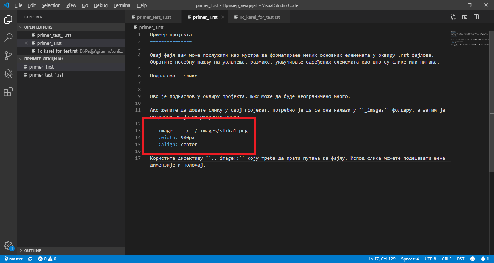

Пример пројекта
===============

Овај фајл вам може послужити као мустра за форматирање неких основних елемената у оквиру .rst фајлова. Препоручујемо вам да отворите фајлове који се налазе у оквиру фолдера ``Пример_лекција1`` док будете читали ово у браузеру и упоредо их читајте у Visual Studio Code-у. Обратите посебну пажњу на увлачења, размаке, укључивање одређених елемемата као што су слике или код.  

Овде ће бити наведене само понеки одабрани, често коришћени елементи. Ако желите да сазнате више, погледајте `овај линк <https://www.sphinx-doc.org/en/master/usage/restructuredtext/index.html>`__ како бисте се снашли са синтаксом ``restructuredText-a`` и `овај линк <https://runestone.academy/runestone/static/authorguide/index.html>`__ како бисте боље разумели ``runestone`` директиве (а обратите пажњу и на то како је линк форматиран). 

Поднаслов
---------

Ово је поднаслов у оквиру пројекта. Њих може да буде неограничено много. 

Ако желите да додате слику у свој пројекат, потребно је да се она налази у ``_images`` фолдеру, а затим је потребно да је ви укључите овако 

Користите директиву ``.. image::`` коју треба да прати путања ка фајлу. Испод слике можете подешавати њене димензије и положај. 

Код у браузеру
--------------

Да бисте приказали код можете да искористите више директива. 
Прво је потребно да одлучите да ли желите да се тај код извршава у браузеру или то није потребно.

Ако желите да се код извршава, то можете урадити овако:

.. activecode:: primer1
   :caption: Naslov
   :nocodelens:

   import turtle
   t = turtle.Turtle()

   for i in range(4):
       t.forward(100)
       t.left(90)

За детаљнији преглед ове директиве погледајте `овај линк <https://runestone.academy/runestone/static/authorguide/directives/activecode.html>`__

Ако код не мора да се извршава, то можете урадити овако 

.. activecode:: yaml2
    :passivecode: true

    import turtle
    t = turtle.Turtle()

    for i in range(4):
        t.forward(100)
        t.left(90)

Или овако, ако желите да користите другачију директиву:

      .. code-block:: python
     
        from karel import *   
        napred()    
        for i in range(5):    
          uzmi()
        napred()
        for i in range(5):
          ostavi()

Ако желите нешто посебно да истакнете то можете урадити овако 

.. infonote:: Подсетник и смернице: 
            
            - ово је сада издвојено од остатка текста 

Ако желите да се неки елемет приказује само када кликнете на њега, то можете урадити овако 

.. reveal:: sakrivanj
   :showtitle: Кликните овде за приказ
   :hidetitle: Сакриј прозор
   
   .. infonote:: Ову директиву сакривамо
    
        Унутар ове директиве налази се текст који треба приказати или сакрити. Обратите пажњу на назубљивање када се у оквиру одређених директива (у овом случају ``..reveal::``) налазе друге директиве (``..infonote``).

