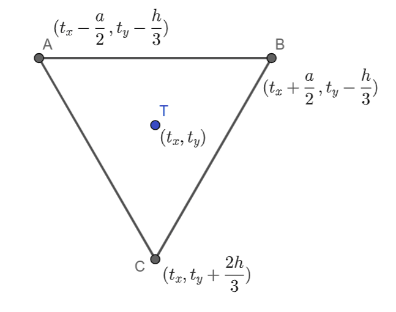
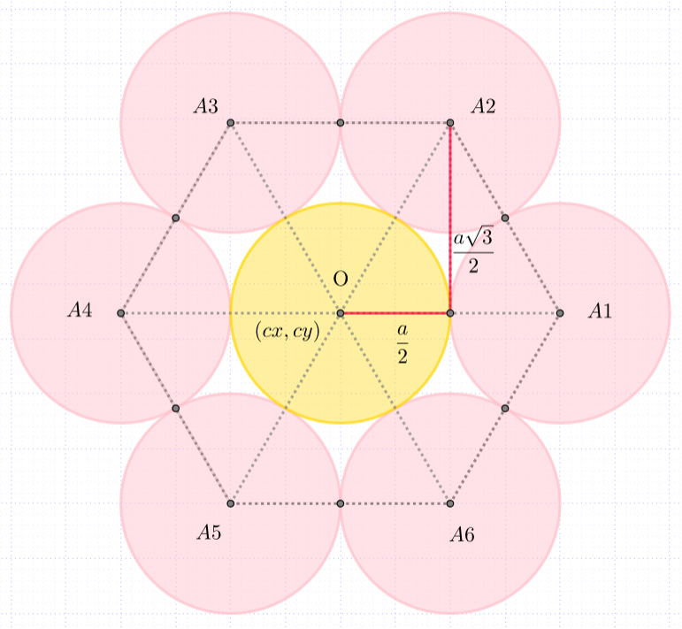

9.1. Релативне координате - утврђивање
======================================

Упознали смо се са релативно задатим координатама и
предностима тог механизма цртања. Утврдимо ово кроз примере који следе.

Примери:
--------

Саобраћајни знак од једнакостраничних троуглова
'''''''''''''''''''''''''''''''''''''''''''''''

.. questionnote::

   Напиши програм који исцртава саобраћајни знак укрштања са путем са
   првенством пролаза који је у облику жутог једнакостраничног троугла
   са црвеном ивицом, окренутог тако да му је хоризонтална основица
   горе.

Ефекат троугла који је жуте боје и има дебелу црвену ивицу постићи
ћемо тако што ћемо нацртати прво већи црвени троугао, а затим мањи
жути троугао. Та два троугла ћемо поставити тако да им се тежишта
(уједно и све значајне тачке) поклапају и да су исто оријентисани.

Приликом цртања саобраћајног знака потребно је да одредимо поступак
којим се црта једнакостранични троугао. Сидро ћемо 
поставити у тежиште :math:`T`, које има
координате :math:`(t_x, t_y)`. Димензија троугла може
бити било дужина странице :math:`a`, било висина :math:`h`, јер се из
једне од ових димензија друга једноставно израчунава на основу познате
везе :math:`h = \frac{a\sqrt{3}}{2}`. 

.. learnmorenote::
   Веза :math:`h = \frac{a\sqrt{3}}{2}` се лако изводи применом
   Питагорине теореме на правоугли троугао чија је једна катета висина
   једнакостраничног троугла, друга половина странице, а хипотенуза је
   страница једнакостраничног троугла.
   

Из математике знамо да тежиште троугла дели тежишну дуж (у
овом случају то је уједно и висина) у односу :math:`2:1`, тако да су координате
темена :math:`A` и :math:`B` у односу на ову тачку померене
(транслиране) на горе за :math:`\frac{1}{3}h`, док је тачка :math:`C`
померена на доле за :math:`\frac{2}{3}h`.

Координате :math:`x` ових тачака одређујемо у односу на тачку :math:`T`,
користећи дужину странице :math:`a`. Тачка :math:`А` је померена од
тежишта за :math:`\frac{а}{2}` ка левој ивици прозора. Тачка :math:`В`
је померена од тежишта за :math:`\frac{а}{2}` ка десној
ивици. Тачка :math:`C` има исту :math:`x` координату као и тежиште.

Дакле, тачка :math:`A` има координате :math:`(t_x-\frac{a}{2},
t_y-\frac{h}{3})`, тачка :math:`B` има координате
:math:`(t_x+\frac{a}{2}, t_y-\frac{h}{3})`, док тачка :math:`C` има
координате :math:`(t_x, t_y+\frac{2h}{3})`.
    
Пошто је потребно да нацртамо два троугла, можемо дефинисати функцију
за цртање троугла и позвати је два пута (за исто тежиште, али
различите боје и димензије). Тежиште ћемо поставити хоризонтално на
средину прозора, док ћемо га вертикално поставити тако да троугао
делује центриран по средини прозора. Оставићемо простор (маргину) од по
30 пиксела изнад и испод троугла, а тежиште троугла ћемо поставити
тако да преосталу висину дели у односу 1:2.

На основу претходне дискусије допуни наредни програм:
	   
.. activecode:: obojeni_trougao
   :nocodelens:
   :modaloutput: 
   :enablecopy:
   :playtask:
   :includexsrc: _includes/saobracajni_znak_trougao.py

   def jedakostranicni_trougao(tx, ty, h, boja):
       a = h * 2 / math.sqrt(3)       # dužina stranice
       # koordinate temena - težište deli visinu u odnosu 1 : 2
       A = (tx - a/2, ty - h/3)
       B = (???, ???)
       C = (???, ???)
       pg.draw.polygon(prozor, ???, ???)
   
   # bojimo pozadinu prozora u belo
   prozor.fill(pg.Color("white"))
   margina = 30
   h = visina - 2*margina
   (tx, ty) = (sirina / 2, margina + h / 3)
   jedakostranicni_trougao(tx, ty, h, pg.Color("red"))
   jedakostranicni_trougao(tx, ty, 0.65*h, pg.Color("yellow"))

Проблеми приликом израчунавања параметара кругова
-------------------------------------------------

Подсетимо се да, за разлику од функција за цртање линија и
правоугаоника које примају и реалне аргументе, функција за цртање
кругова захтева да су координате центра круга и дужина полупречника
искључиво цели бројеви. Ово може довести до одређених проблема у
програмима у којима се ти аргументи израчунавају у програму. Када
видиш поруку ``TypeError: integer argument expected, got float``, тада
знај да је проблем у томе што је функцији за цртање круга уместо целог
прослеђен неки реалан број и тај проблем можеш лако решити коришћењем
неког облика заокруживања бројева.

Зато ћемо често у задацима у којима цртамо кругове, морати да
користимо заокруживање реалних бројева (функцијом ``round`` или
функцијом ``int``) када извршимо потребна израчунавања.

Провери да ли ово разумеш тако што ћеш одговорити на наредно питање:

.. mchoice:: pygame_quiz_greska_float
   :answer_a: Није наведен добар број параметара у позиву функције `pg.draw.circle`
   :answer_b: Координате центра не могу бити реални бројеви
   :answer_c: Редослед параметара у позиву није исправан
   :answer_d: Полупречник круга не сме да буде негативан број
   :answer_e: Потребно је навести још дебљину кружнице
   :correct: b
   :feedback_a: Покушај поново
   :feedback_b: Тачно
   :feedback_c: Покушај поново
   :feedback_d: Покушај поново
   :feedback_e: Покушај поново

   Након позива `pg.draw.circle(prozor, boja, (x, y), r)` пријављена
   је грешка `TypeError: integer argument expected, got float`. Шта
   може бити узрок те грешке?
   

Наредни програм црта цвет састављен од кругова, али не ради исправно и
твој задатак је да га поправиш.

Цвет
''''

.. questionnote::

   Напиши програм који исцртава цвет који се састоји од централног
   жутог круга пречника 100 пиксела, око којег се налази 6 правилно
   распоређених латица розе боје, свака у облику круга, такође
   пречника 100 пиксела (центри латица се налазе у теменима правилног
   шестоугла, чији је центар у центру цвета, а дужина странице је 100
   пиксела).

   
За цртање круга потребно је знати координате центра и дужину
полупречника круга. Пречник свих кругова је једнак, самим тим и
полупречник :math:`r = \frac{a}{2}`.  Нека је тачка О центар жутог,
централног круга. Координате ове тачке означимо са :math:`(c_x,
c_y)`. Ова тачка се налази у центру прозора и њене координате једнаке
су половини висине, односно ширине прозора. Координате осталих
центара кругова изразићемо такође преко координата :math:`(c_x, c_y)`.  
Координате тачке :math:`А_1` означимо са :math:`(x_1, y_1)`. Тачка
:math:`А_1` је за :math:`a` померена (транслирана) од тачке О по оси
:math:`x`, тако да је :math:`x_1`, прва координата ове тачке једнака
:math:`x_1 = c_x + a`, а друга координата ове тачке :math:`y_1`
једнака је :math:`y` координати тачке О, тј. :math:`y_1 = c_y`.
Координате тачке :math:`А_2` означимо са :math:`(x_2, y_2)`. Ова тачка
је у односу на тачку О померена (транслирана) за :math:`\frac{a}{2}`
по оси :math:`x`, односно за висину :math:`h = \frac{a \sqrt{3}}{2}`
једнакостраничног троугла :math:`\triangle OA_1A_2` по оси `y`. На
основу овога закључујемо да су координате тачке :math:`А_2`
:math:`(x_2, y_2) = (c_x+\frac{a}{2}, c_y + h)`.  Координате центра
осталих кругова одређујемо на сличан начин.

На основу претходне дискусије, допуни наредни програм и поправи
грешке везане за тип података бројева:
   
.. activecode:: cvet
   :nocodelens:
   :modaloutput: 
   :enablecopy:
   :playtask:
   :includexsrc: _includes/cvet.py

   # bojimo pozadinu u belo
   prozor.fill(BELA)

   # koordinate centra prozora
   (cx, cy) = (sirina / 2, visina / 2)

   # prečnici krugova - dužina stranice pravilnog šestougla u čijim se
   # temenima nalaze centri krugova
   a = 100
   # visina karakterističnog trougla šestougla
   h = a * math.sqrt(3) / 2

   # sva temena šestougla dele ove koordinate
   x1 = cx - a
   x2 = cx - a/2
   x3 = cx + a/2
   x4 = cx + a
   y1 = ???
   y2 = cy
   y3 = ???

   # koordinate temena šestougla
   O = (cx, cy)
   A1 = (x1, y2)
   A2 = (???, ???)
   A3 = (???, ???)
   A4 = (???, ???)
   A5 = (???, ???)
   A6 = (???, ???)

   # poluprečnik krugova
   r = a / 2

   # iscrtavamo krugove
   pg.draw.circle(prozor, ZUTA, O, r)
   pg.draw.circle(prozor, ROZE, A1, r)
   pg.draw.circle(prozor, ROZE, A2, ???)
   pg.draw.circle(prozor, ROZE, ???, ???)
   pg.draw.circle(prozor, ROZE, ???, ???)
   pg.draw.circle(prozor, ROZE, ???, ???)
   pg.draw.circle(prozor, ROZE, ???, ???)

