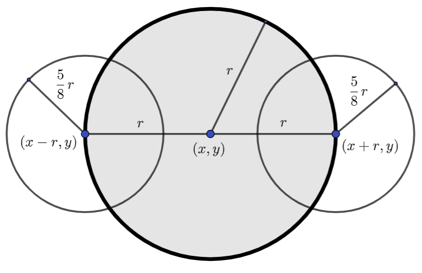

8.4. Домаћи задатак
====================

Облак
-----

Круговима можемо нацртати и неке занимљиве облике. 

.. questionnote::
   Нацртајмо сунце и облак на плавом небу.

.. activecode:: oblak
   :passivecode: onlymain
   :autorun:
   :includesrc: _includes/oblak.py

   Облак
   ~~~~

.. questionnote::

   Данас се мало наоблачило. На основу претходног програма
   дефинисаћемо функцију која исцртава облак на задатој позицији,
   задате величине, у задатој нијанси сиве боје, а затим ћемо је
   неколико пута позвати да бисмо нацртали неколико облака.

Приметимо да смо облак нацртали помоћу три круга и да су координате и
полупречници ових кругова задати апсолутно, помоћу конкретних
бројева. Да бисмо омогућили цртање неколико облака различитог положаја
и величине, потребно је да пређемо на релативно задате
координате. Природно је да за сидро узмемо центар средишњег круга, а
да за димензију облака узмемо његов полупречник. Из претходног примера
се може видети да је полупречник мањих кругова једнак :math:`\frac{5}{8}`
већег полупречника. Такође, видимо да су центри тих
кругова на истој висини као центар великог круга и да се налазе на великој
кружници. Стога, ако претпоставимо да велики круг има центар у тачки
:math:`(x, y)` и да му је полупречник `r`, тада први мали круг има
центар у тачки :math:`(x-r, y)`, а други у тачки :math:`(x+r, y)` и
оба имају полупречник :math:`\frac{5r}{8}`.

На основу овога можемо једноставно дефинисати функцију која црта облак
и затим је неколико пута позвати.
   
.. activecode:: oblaci
   :nocodelens:
   :modaloutput: 
   :enablecopy:
   :playtask:
   :includexsrc: _includes/oblaci.py

   # bojimo pozadinu u plavo
   prozor.fill(pg.Color("skyblue"))
    
   # crtamo sunce
   pg.draw.circle(prozor, pg.Color("yellow"), (100, 100), 80)
    
   # funkcija koja crta oblak na datoj poziciji, date velicine u datoj
   # nijansi sive boje
   def oblak(x, y, r, siva):
       # nijansa sive boje
       boja = [???, ???, ???]
       # crtamo oblak od tri kruga
       # centralni veliki krug oblaka
       pg.draw.circle(???, ???, ???, ???)
       # poluprecnik levog i desnog, manjeg kruga oblaka
       r_malo = round(5 * r / 8)
       # levi manji krug oblaka
       pg.draw.circle(???, ???, ???, ???)
       # desni manji krug oblaka
       pg.draw.circle(???, ???, ???, ???)

   # crtamo nekoliko oblika razlicite velicine i nijanse
   oblak(240, 200, 40, 180)
   oblak(270, 250, 50, 210)
   oblak(230, 100, 50, 230)
   oblak(80, 80, 30, 150)
   oblak(110, 320, 60, 255)