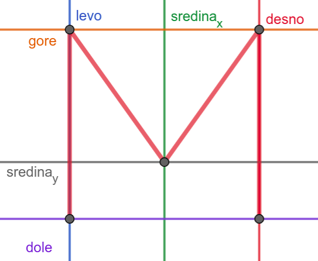
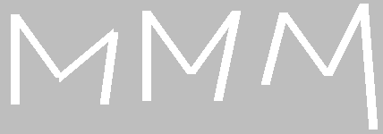
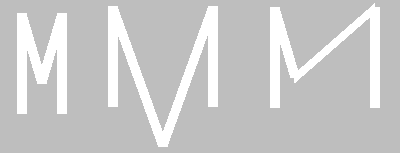

8.3. Релативне координате и димензије
=====================================

Израчунавање координата у односу на главну тачку и димензију
------------------------------------------------------------

У досадашњим примерима смо у функцијама за цртање координате задавали
навођењем конкретних бројевних вредности (на пример, 100, 50, 20).  За
такве цртеже рећи ћемо да су задати коришћењем **апсолутних
координата**. У наставку ћемо видети да је често и лакше и боље да се
координате представљају променљивама и то тако да се све координате
израчунавају само на основу координата једне карактеристичне тачке
коју ћемо називати **главна тачка** или **сидро** (енгл. *anchor*) и на
основу димензије цртежа. За такве цртеже рећи ћемо да су
задати коришћењем **релативних координата**.

.. infonote::
   Сидро цртежа бирамо по сопственој жељи. Међутим, циљ нам је добар избор сидра (о чему ће
   више бити речи кроз пример у наставку лекције) који програм чини
   једноставнијим за писање и разумевање.

То ће нам омогућити да цео цртеж померамо
само изменама координата главне тачке (сидра) и да га скалирамо само променом
димензије, али и да лако нацртамо више цртежа који исто изгледају, а чији се
положај и величина могу разликовати. 

Слово М
'''''''

Хајде сада да скалирамо објекат који се састоји од више дужи!

.. questionnote::

   Напиши програм који помоћу дужи исцртава слово M.

Приликом цртања слова А координате смо очитали са цртежа и директно
унели у програм. Сада ћемо нацртати слово М. Да би дужи биле лепо
поравнате, потребно је да две горње тачке буду на истој висини и да
две доње тачке буду на истој висини, да су две леве тачке на истој
ширини и да су две десне тачке на истој ширини и да је средња тачка по
ширини тачно на средини између левих и десних тачака.

Ако мало боље проучимо положај 5 карактеристичних тачака, можемо видети
да све оне користе само три могуће вредности координате :math:`x`: лево, средина, десно (на
пример, 50, 100 и 150) и само три могуће вредности координате
:math:`y`: горе, средина, доле (на пример, 50, 120 и 150). Ове вредности можемо представити
променљивама ``gore``, ``dole``, ``levo``, ``desno``, ``sredina_x`` и
``sredina_y``, које на почетку програма иницијализујемо (постављамо)
на одговарајуће вредности. Прва усправна дуж која гради слово М
задата је тачкама ``(levo, gore)`` и ``(levo, dole)``. Дуж
паралелна овој дужи описана је тачкама ``(desno, gore)`` и
``(desno, dole)``, а унутрашње дужи тачкама ``(levo, gore)`` и ``(sredina_x,
sredina_y)``, односно ``(sredina_x, sredina_y)`` и ``(desno, gore)``.

.. activecode:: slovoM
   :nocodelens:
   :modaloutput: 
   :enablecopy:
   :playtask:
   :includexsrc: _includes/slovo_M.py

   # bojimo pozadinu prozora u sivo
   prozor.fill(pg.Color(???))
    
   # debljina linije
   debljina = 10
    
   # horizontalne koordinate tačaka
   levo = 50
   sredina_x = 100
   desno = 150
   
   # vertikalne koordinate tačaka
   gore = 50
   sredina_y = 120
   dole = 150
    
   # leva vertikalna linija
   pg.draw.line(prozor, pg.Color("white"), (???, ???), (???, ???), debljina)
   # kosa linija 
   pg.draw.line(prozor, pg.Color("white"), (???, ???), (???, ???), debljina)
   # kosa linija
   pg.draw.line(prozor, pg.Color("white"), (???, ???), (???, ???), debljina)
   # desna vertikalna linija
   pg.draw.line(prozor, pg.Color("white"), (???, ???), (???, ???), debljina)

.. reveal:: slovoM_1
  :showtitle: Прикажи решење
  :hidetitle: Сакриј решење

  .. activecode:: slovoM_resenje
    :nocodelens:
    :includesrc: _includes/slovo_M.py

Предност оваквог писања кôда се види када једном напишемо програм који 
исправно приказује слово М, али је сада потребно да се промени положај или 
величина овог слова. Уместо да мењамо 10 бројева (по две координате пет 
карактеристичних тачака), ми их мењамо само 6, **не дирајући део кôда у коме 
се црта**. Тиме што не мењамо наредбе за цртање, осигурали смо се да више не 
можемо много да прогрешимо. На пример, како год да мењамо вредности променљивих 
``levo``, ``sredina_x``, ``desno``, ``gore``, ``sredina_y``, ``dole``, више 
никако не можемо да добијемо овакве слике...

...јер ће спољне дужи сигурно бити усправне и једнаке по дужини. Додуше, ако 
погрешно израчунамо или заборавимо да променимо неку од величина, и даље 
можемо да добијемо овакве слике:

Да би промена положаја и величине слова М била још лакша и мање подложна
грешкама, можемо отићи и један корак даље и све координате израчунати само на
основу положаја једне карактеристичне тачке цртежа и димензије цртежа.
Карактеристичну тачку, коју називамо **сидро**, увек бирамо према нашој жељи. Међутим, како би при
програмирању имали што већу корист
од њеног избора, најбоље место је негде у средини цртежа како би се тачке потребне 
наредбама за цртање (када их посматрамо све заједно) налазиле на што мањој удаљености.
На тај начин њихов положај у односу на сидро се једноставније рачуна у програму што и сам програм чини
једноставнијим за писање и разумевање.
Такође, добро је да се нека од њих налази тачно у карактеристичној тачки, што доноси корист да се њен
положај на слици не рачуна додатно у програму.
Конкретно, у примеру који следи, за карактеристичну тачку можемо узети (уједно и као најбољи избор) 
тачку у средини, у којој се спајају две косе линије.

.. activecode:: slovoM_sve_relativno
   :nocodelens:
   :modaloutput: 
   :enablecopy:
   :playtask:
   :includexsrc: _includes/slovo_M.py

   # bojimo pozadinu prozora u sivo
   prozor.fill(pg.Color(???))
    
   # debljina linije
   debljina = 10

   # sidro - tačka na kojoj se susreću kose linije
   sredina_x = 100
   sredina_y = 120

   # dimenzija slova
   dim = 100
   
   # vertikalne koordinate tačaka
   gore = sredina_y - 0.7 * dim
   dole = sredina_y + 0.3 * dim
    
   # horizontalne koordinate tačaka
   levo = sredina_x - 0.5 * dim
   desno = sredina_x + 0.5 * dim
    
   # leva vertikalna linija
   pg.draw.line(prozor, pg.Color("white"), (???, ???), (???, ???), debljina)
   # kosa linija 
   pg.draw.line(prozor, pg.Color("white"), (???, ???), (???, ???), debljina)
   # kosa linija
   pg.draw.line(prozor, pg.Color("white"), (???, ???), (???, ???), debljina)
   # desna vertikalna linija
   pg.draw.line(prozor, pg.Color("white"), (???, ???), (???, ???), debljina)

Сада веома једноставно можемо да променимо димензију и положај слова
М. Поиграј се мало вредностима променљивих ``dim``, ``sredina_x`` и
``sredina_y`` и посматрај како се мења нацртано слово. Како год да мењаш ове
три вредности, више није могуће добити деформисано слово М, јер је оно увек 
симетрично и складних пропорција, истих као полазно слово. Дакле, када је
цртеж нацртан релативно, у односу на неко сидро и димензију, он се
лако може померати по прозору и скалирати, тако што му се промени
вредност сидра и димензија. Ово нам омогућава да цртање издвојимо у функцију која
као параметре прихвата координате сидра и димензију и тако можемо лако
нацртати неколико појављивања истог облика.

.. activecode:: slovoM_sve_relativno_funkcija
   :nocodelens:
   :modaloutput: 
   :enablecopy:
   :includexsrc: _includes/slovo_M.py

   def slovo_M(x, y, dim):
       # debljina linije
       debljina = 5
       
       # vertikalne koordinate tačaka
       gore = y - 0.7 * dim
       dole = y + 0.3 * dim
    
       # horizontalne koordinate tačaka
       levo = x - 0.5 * dim
       desno = x + 0.5 * dim
    
       # leva vertikalna linija
       pg.draw.line(prozor, pg.Color("white"), (levo, gore), (levo, dole), debljina)
       # kosa linija 
       pg.draw.line(prozor, pg.Color("white"), (levo, gore), (x, y), debljina)
       # kosa linija
       pg.draw.line(prozor, pg.Color("white"), (desno, gore), (x, y), debljina)
       # desna vertikalna linija
       pg.draw.line(prozor, pg.Color("white"), (desno, gore), (desno, dole), debljina)
       

   # bojimo pozadinu prozora u sivo
   prozor.fill(pg.Color("gray"))
   # crtamo 3 slova M
   slovo_M(50, 100, 50)
   slovo_M(110, 100, 40)
   slovo_M(160, 100, 30)

.. topic:: Погледај видео:

   Погледај овај видео како би додатно разумео/разумела шта је урађено у овом задатку и како то сам/сама да урадиш на свом рачунару. 

    .. ytpopup:: m_XSTyfEYrk
        :width: 735
        :height: 415
        :align: center 

Најважније из ове лекције:
--------------------------

* Приликом смањивања и повећавања објеката треба пазити да се не поремете њихови међусобни односи и положај у прозору.
* Главни задатак релативног представљања координата и димензија је у томе да се све димензије и координате представе у односу на неку референтну тачку (сидро).
* Важно је да се све време приликом писања програма са релативним координатама и димензијама размишља о томе да желимо да уопштимо кôд који пишемо, тако да касније можемо да га искористимо без много модификација - када напишемо функцију за цртање неког облика, тај облик можемо лако нацртати у различитим величинама и положајима. Много више времена бисмо морали да потрошимо да сваки појединачни облик цртамо засебно.  
