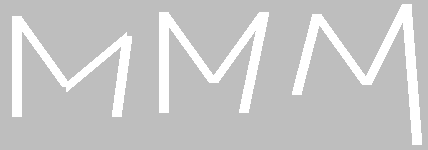
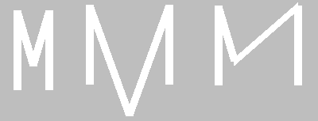

8.3. Релативне координате и димензије
=====================================
   
Скалирање и центрирање цртежа са више објеката
----------------------------------------------

Круг уписан у квадрат
'''''''''''''''''''''

.. questionnote::
   Нацртајмо квадрат на средини прозора и у њему уписан круг:

.. activecode:: povecavanje_i_smanjivanje_objekata
   :nocodelens:
   :modaloutput: 
   :enablecopy:
   :includexsrc: _includes/centrirani_pravougaonici_i_elipse.py

   prozor.fill(pg.Color("white"))
   pg.draw.rect(prozor, pg.Color("red"), (100, 100, 100, 100))
   pg.draw.circle(prozor, pg.Color("blue"), (150, 150), 50) # unesite poluprecnik kruga

.. infonote::
   Често цртеж желимо да прилагодимо тако што ћемо га *скалирати*
   (смањити или повећати). Ако желимо да нацртамо двоструко већи круг,
   потребно је навести двоструко већи полупречник, а ако је потребно
   нацртати двоструко већи квадрат, потребно је навести двоструко већу ширину и висину. 
   Такође, ако желимо да нацртамо двоструко мањи круг,
   потребно је навести двоструко мањи полупречник, а ако је потребно
   нацртати двоструко мањи квадрат, потребно је навести двоструко мању ширину и висину. 

Испробај ово на претходном цртежу тако што
ћеш смањити димензије  на 50, а полупречник круга на 25.

Као што видиш, објекти су се смањили, али круг више није уписан у
квадрат и цртеж не изгледа више како би требало да изгледа
(центар круга и горње лево теме квадрата су остали
непромењени). 

.. infonote::
   Дакле, да бисмо смањили или повећали цртеж од више елемената, није довољно само повећати
   или смањити његове објекте. Потребно је да мењамо и координате које одређују положај објеката. 

Испробај на претходном цртежу шта би се десило када би сваки од бројева који се користе приликом
цртања био помножен или подељен истим бројем. 

Приметимо да објекти мењају место али остају центрирани - то је због тога што смо адекватно мењали координате!

.. mchoice:: pygame_quiz_efekat_deljenja_koordinata
   :answer_a: Цртеж ће се дупло смањити и помериће се ка горњем левом углу прозора.
   :answer_b: Цртеж ће се дупло смањити и остаће на истом месту.
   :answer_c: Цртеж ће остати исте величине и помериће се ка доњем десном углу прозора.
   :answer_d: Цртеж ће се дупло повећати и помериће се ка горњем левом углу прозора.
   :correct: a
   :feedback_a: Тачно
   :feedback_b: Покушај поново
   :feedback_c: Покушај поново
   :feedback_d: Покушај поново

   Сви бројеви који се односе на координате и на величине у једном
   цртежу су подељени са 2. Како ће тиме да се промени цртеж?

.. infonote::
   Множењем свих аргумената функција истим бројем, дакле, успешно
   скалирамо цртеж, међутим, цртеж уједно бива померен, што је понекад
   непожељно. Скалирање цртежа уз задржавање положаја генерално није
   једноставно учинити. Међутим, у наставку ћемо видети како да цртеже
   направимо тако да их лако можемо и померати и скалирати.

Израчунавање координата у односу на главну тачку и димензију
------------------------------------------------------------

У досадашњим примерима смо у функцијама за цртање координате задавали
навођењем конкретних бројевних вредности (на пример, 100, 50, 20).  За
такве цртеже рећи ћемо да су задати коришћењем **апсолутних
координата**. У наставку ћемо видети да је често и лакше и боље да се
координате представљају променљивама, и то тако да се све координате
израчунавају само на основу координата једне карактеристичне тачке
коју ћемо називати **главна тачка** или **сидро** (енгл. anchor) и на
основу димензије цртежа. За такве цртеже рећи ћемо да су
задати коришћењем **релативних координата**.

.. reveal:: усидрени_сртежи
   :showtitle: Сазнај више
   :hidetitle: Сакриј

   .. infonote::
      То ће нам омогућити да цео цртеж померамо
      само изменама координата главне тачке и да га скалирамо само променом
      димензије, али и да лако нацртамо више цртежа који исто изгледају, а чији се
      положај и величина могу разликовати. 

Слово М
'''''''

Хајде сада да скалирамо објекат који се састоји од више дужи!

.. questionnote::

   Напиши програм који помоћу дужи исцртава слово M.

Приликом цртања слова А координате смо очитали са цртежа и директно
унели у програм. Сада ћемо нацртати слово М. Да би дужи биле лепо
поравнате, потребно је да две горње тачке буду на истој висини и да
две доње тачке буду на истој висини, да су две леве тачке на истој
ширини и да су две десне тачке на истој ширини и да је средња тачка по
ширини тачно на средини између левих и десних тачака.

.. image:: ../../_images/slovoM.png
   :width: 300px   
   :align: center 

Ако мало боље проучимо положај 5 карактеристичних тачака, можемо видети
да све оне користе само три могуће вредности координате :math:`x`: лево, средина, десно (на
пример, 50, 100 и 150) и само три могуће вредности координате
:math:`y`: горе, средина, доле (на пример, 50, 120 и 150). Ове вредности можемо представити
променљивама ``gore``, ``dole``, ``levo``, ``desno``, ``sredina_x`` и
``sredina_y``, које на почетку програма иницијализујемо (постављамо)
на одговарајуће вредности. Прва усправна дуж која гради слово М
задата је тачкама ``(levo, gore)`` и ``(levo, dole)``. Дуж
паралелна овој дужи описана је тачкама ``(desno, gore)`` и
``(desno, dole)``, а унутрашње дужи тачкама ``(levo, gore)`` и ``(sredina_x,
sredina_y)``, односно ``(sredina_x, sredina_y)`` и ``(desno, gore)``.

.. activecode:: slovoM
   :nocodelens:
   :modaloutput: 
   :enablecopy:
   :playtask:
   :includexsrc: _includes/slovo_M.py

   # bojimo pozadinu prozora u sivo
   prozor.fill(pg.Color(???))
    
   # debljina linije
   debljina = 10
    
   # horizontalne koordinate tačaka
   levo = 50
   sredina_x = 100
   desno = 150
   
   # vertikalne koordinate tačaka
   gore = 50
   sredina_y = 120
   dole = 150
    
   # leva vertikalna linija
   pg.draw.line(prozor, pg.Color("white"), (???, ???), (???, ???), debljina)
   # kosa linija 
   pg.draw.line(prozor, pg.Color("white"), (???, ???), (???, ???), debljina)
   # kosa linija
   pg.draw.line(prozor, pg.Color("white"), (???, ???), (???, ???), debljina)
   # desna vertikalna linija
   pg.draw.line(prozor, pg.Color("white"), (???, ???), (???, ???), debljina)

Предност оваквог писања кôда се види када једном напишемо програм који 
исправно приказује слово М, али је сада потребно да се промени положај или 
величина овог слова. Уместо да мењамо 10 бројева (по две координате пет 
карактеристичних тачака), ми их мењамо само 6, **не дирајући део кôда у коме 
се црта**. Тиме што не мењамо наредбе за цртање, осигурали смо се да више не 
можемо много да прогрешимо. На пример, како год да мењамо вредности променљивих 
``levo``, ``sredina_x``, ``desno``, ``gore``, ``sredina_y``, ``dole``, више 
никако не можемо да добијемо овакве слике...

јер ће спољне дужи сигурно бити усправне и једнаке по дужини. Додуше, ако 
погрешно израчунамо или заборавимо да променимо неку од величина, и даље 
можемо да добијемо овакве слике:

Да би промена положаја и величине слова М била још лакша и мање подложна
грешкама, можемо отићи и један корак даље и све координате израчунати само на
основу положаја једне карактеристичне тачке цртежа и димензије цртежа.
На пример, за карактеристичну тачку можемо узети тачку у средини, у
којој се спајају две косе линије. Тако одабрана карактеристична тачка
цртежа назива се **сидро**.

.. activecode:: slovoM_sve_relativno
   :nocodelens:
   :modaloutput: 
   :enablecopy:
   :playtask:
   :includexsrc: _includes/slovo_M.py

   # bojimo pozadinu prozora u sivo
   prozor.fill(pg.Color(???))
    
   # debljina linije
   debljina = 10

   # sidro - tačka na kojoj se susreću kose linije
   sredina_x = 100
   sredina_y = 120

   # dimenzija slova
   dim = 100
   
   # vertikalne koordinate tačaka
   gore = sredina_y - 0.7 * dim
   dole = sredina_y + 0.3 * dim
    
   # horizontalne koordinate tačaka
   levo = sredina_x - 0.5 * dim
   desno = sredina_x + 0.5 * dim
    
   # leva vertikalna linija
   pg.draw.line(prozor, pg.Color("white"), (???, ???), (???, ???), debljina)
   # kosa linija 
   pg.draw.line(prozor, pg.Color("white"), (???, ???), (???, ???), debljina)
   # kosa linija
   pg.draw.line(prozor, pg.Color("white"), (???, ???), (???, ???), debljina)
   # desna vertikalna linija
   pg.draw.line(prozor, pg.Color("white"), (???, ???), (???, ???), debljina)

Сада веома једноставно можемо да променимо димензију и положај слова
М. Поиграј се мало вредностима променљивих ``dim``, ``sredina_x`` и
``sredina_y`` и посматрај како се мења нацртано слово. Како год да мењаш ове
три вредности, више није могуће добити деформисано слово М, јер је оно увек 
симетрично и складних пропорција, истих као полазно слово. Дакле, када је
цртеж нацртан релативно, у односу на неко сидро и димензију, он се
лако може померати по прозору и скалирати, тако што му се промени
вредност сидра и димензија. Ово нам омогућава да цртање издвојимо у функцију која
као параметре прихвата координате сидра и димензију и тако можемо лако
нацртати неколико појављивања истог облика.

.. activecode:: slovoM_sve_relativno_funkcija
   :nocodelens:
   :modaloutput: 
   :enablecopy:
   :includexsrc: _includes/slovo_M.py

   def slovo_M(x, y, dim):
       # debljina linije
       debljina = 5
       
       # vertikalne koordinate tačaka
       gore = y - 0.7 * dim
       dole = y + 0.3 * dim
    
       # horizontalne koordinate tačaka
       levo = x - 0.5 * dim
       desno = x + 0.5 * dim
    
       # leva vertikalna linija
       pg.draw.line(prozor, pg.Color("white"), (levo, gore), (levo, dole), debljina)
       # kosa linija 
       pg.draw.line(prozor, pg.Color("white"), (levo, gore), (x, y), debljina)
       # kosa linija
       pg.draw.line(prozor, pg.Color("white"), (desno, gore), (x, y), debljina)
       # desna vertikalna linija
       pg.draw.line(prozor, pg.Color("white"), (desno, gore), (desno, dole), debljina)
       

   # bojimo pozadinu prozora u sivo
   prozor.fill(pg.Color("gray"))
   # crtamo 3 slova M
   slovo_M(50, 100, 50)
   slovo_M(110, 100, 40)
   slovo_M(160, 100, 30)

.. topic:: Погледај видео:

   Погледај овај видео како би додатно разумео/разумела шта је урађено у овом задатку и како то сам/сама да урадиш на свом рачунару. 

    .. ytpopup:: m_XSTyfEYrk
        :width: 735
        :height: 415
        :align: center 

Најважније из ове лекције:
--------------------------

* Приликом смањивања и повећавања објеката треба пазити да се не поремете њихови међусобни односи и положај у прозору.
* Главни задатак релативног представљања координата и димензија је у томе да се све димензије и координате представе у односу на неку референтну тачку (сидро).
* Важно је да се све време приликом писања програма са релативним координатама и димензијама размишља о томе да желимо да уопштимо кôд који пишемо, тако да касније можемо да га искористимо без много модификација - када напишемо функцију за цртање неког облика, тај облик можемо лако нацртати у различитим величинама и положајима. Много више времена бисмо морали да потрошимо да сваки појединачни облик цртамо засебно.  
