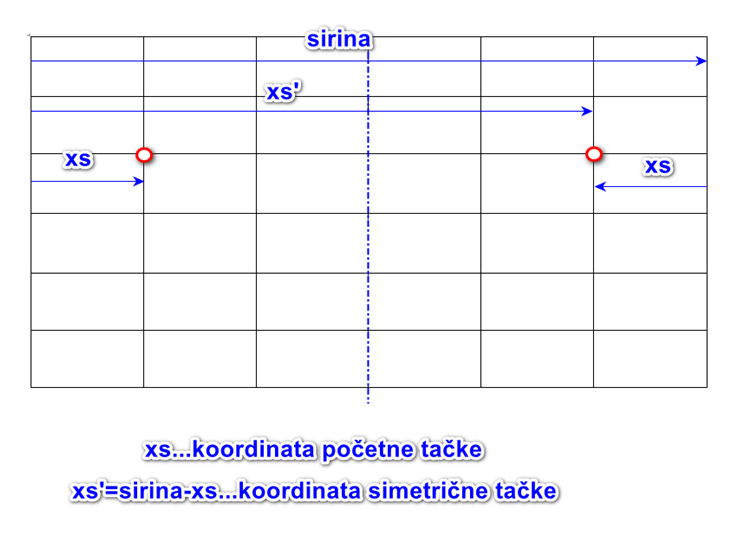
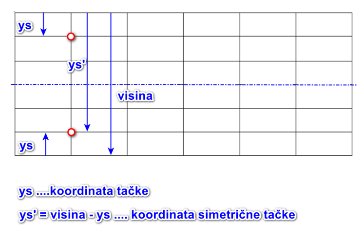

7.1. Симетрично пресликане координате
=====================================

У досадашњим цртежима координате смо углавном очитавали помоћу миша
или су унапред биле задате у тексту задатка. У овом поглављу ћемо
видети како неке координате можемо израчунати на основу познавања
неких других координата.

Израчунавање симетричних координата
------------------------------------

Симетрична координатна тачка се израчунава на различит начин у зависности од тога да ли се ради о вертикалној или хоризонталној оси симетрије. 

**Вертикална оса симетрије**
''''''''''''''''''''''''''''''''''''''''

Координатну тачку симетричну по вертикалној прави можемо израчунати применом једначине :math:`xs' = širina - xs, ys’=ys`, где је :math:`xs` координата оригиналне тачке а :math:`xs'` координата симетричне координатне тачке. Приметићете да координате :math:`уs` и :math:`ys'` заправо остају исте. 

**Хоризонтална оса симетрије**
''''''''''''''''''''''''''''''''''''''''

Координатну тачку симетричну по хоризонталној прави можемо израчунати применом једначине :math:`ys' = visina - ys, xs’=xs`, где је :math:`ys` координата оригиналне тачке а :math:`ys'` координата симетричне координатне тачке. Приметићете да координате :math:`xs` и :math:`xs'` заправо остају исте. 

.. infonote::
   Биће нам веома важан међусобни однос положаја и
   величина објеката у прозору. Kao што знаш, увећавањем :math:`x` координате објекти се
   померају надесно, умањивањем :math:`x` координате на лево, умањивањем y
   координате померају се нагоре, а увећавањем :math:`y` координате, померају се
   надоле.

Симетрични кругови
------------------

Често ће цртежи које цртамо бити симетрични у односу на неку
хоризонталну или вертикалну праву. На пример, ако је прозор ширине 300
пиксела, тада је његова усправна оса удаљена 150 пиксела од леве ивице.
Ако желимо да два круга распоредимо симетрично око те усправне осе прозора
(на пример, желимо да то буду два ока) и ако први круг има центар у
тачки :math:`(110, 80)`, тада други круг треба да има центар у тачки
:math:`(190, 80)`. 

.. activecode:: krugovi_simetricni
   :passivecode: onlymain
   :autorun:
   :includesrc: _includes/krugovi_simetricni.py

Наиме, (хоризонтално) растојање од центра левог круга до
усправне осе треба да буде исто као растојање од те усправне осе до
центра десног круга. Пошто је лево растојање једнако 150 - 110 = 40, десно 
растојање ће такође бити 40, па је *x* координата центра десног круга
150 + 40 = 190. Тачке су на истој висини, па им је :math:`y` координата 
једнака. Веома слично се одређују координате и када је оса симетрије било 
која друга хоризонтална или вертикална права.

Симетрични правоугаоници и елипсе
---------------------------------

.. infonote::
   Поступак одређивања параметара правоугаоника и елипсе која је
   симетрично пресликана мало се разликује од оног за круг или за дуж. Треба
   водити рачуна о томе да је горње **лево** теме правоугаоника описаног
   око тражене елипсе у ствари слика горњег **десног** темена
   правоугаоника описаног око познате елипсе. 

Нека је на слици доле плава елипса позната, а црвена тражена. Погледајте следећи програм и обратите пажњу на 
тачке :math:`M_1` и :math:`M_2`. Такође, обратите пажњу и на горња лева темена ових правоугаоника. Да бисмо 
црвени правоугаоник нацртали као симетричну слику плавог, морамо пронаћи координате горњег левог темена црвеног 
правоугаоника. Да бисмо то урадили, морамо прво да на основу координата тачке :math:`M_1` пронађемо координате 
тачке :math:`M_2`, која је подједнако удаљена од усправне осе прозора као и тачка :math:`M_1`. Након тога, 
биће довољно да одузмемо ширину правоугаоника од :math:`х` координате тачке :math:`M_2` и добићемо :math:`х` 
координату горњег левог темена црвеног правоугаоника.

.. activecode:: pravougaonik_simetrija
   :passivecode: onlymain
   :autorun:
   :includesrc: _includes/pravougaonik_simetrija.py

Мачка
'''''

.. questionnote::

   Напиши програм који црта главу мачке. Глава мачке је потпуно
   симетрична у односу на средину прозора и то се може искористити! 

.. infonote::
   Највећи део посла овде већ је урађен (како бисмо ти помогли). Твој посао је да 
   додаш пет наредби за цртање на предвиђена места. Објашњење које следи односи се на 
   цртање комплетног цртежа и служи да би ти помогло да схватиш симетрије, као и да
   урадиш свој делић посла.

Уши ове мачке могу да се прикажу као попуњени троуглови. Како се уши
надовезују на главу, по два темена сваког троугла могу да буду
изабрана са више слободе (довољно је да буду негде у глави). Осим два
троугла који представљају уши, имамо још:

- два круга (глава и врх њушке),
- шест елипси (очи, зенице и делови њушке),
- шест линија (бркови).

Приликом цртања користе се боје ``gray``, ``darkgray``, ``black``,
``yellow`` и ``green``.

Да видиш слику коју треба да нацрташ, притисни дугме „Прикажи пример“. Ту можеш да очитаваш само координате 
на левој половини слике, а она је већ нацртана у програму помоћу функција за цртање. Исте функције ћеш користити
и за десну половину слике, само са другим координатама. X-координате тачака на десној половини слике се не могу 
очитавати, израчунај их користећи симетрију!

.. activecode:: PyGame_practice1a_cat
   :nocodelens:
   :enablecopy:
   :modaloutput:
   :playtask:
   :includexsrc: _includes/macka_simetricna_pomoc.py

   prozor.fill(pg.Color("white")) # bojimo pozadinu ekrana u belo

   pg.draw.circle(prozor, pg.Color("gray"), (150, 160), 100) # glava
   pg.draw.polygon(prozor, pg.Color("gray"), [(50, 30), (70, 100), (110, 100)]) # levo uvo
   pg.draw.polygon(prozor, pg.Color("gray"), [(250, 30), (230, 100), (190, 100)]) # desno uvo
   pg.draw.ellipse(prozor, pg.Color("yellow"), ( 90, 110, 40, 60)) # levo oko
   ??? # desno oko
   pg.draw.ellipse(prozor, pg.Color("green"),  (105, 135, 20, 30)) # leva zenica
   ??? # desna zenica
   pg.draw.ellipse(prozor, pg.Color("darkgray"),  (80, 180, 70, 30)) # levi deo njuske
   ??? # desni deo njuske
   ??? # vrh njuske
   pg.draw.line(prozor, pg.Color("black"), (90, 190), (20, 160), 2) # levi gornji brk
   pg.draw.line(prozor, pg.Color("black"), (90, 195), (20, 195), 2) # levi srednji brk
   pg.draw.line(prozor, pg.Color("black"), (90, 200), (20, 220), 2) # levi donji brk
   pg.draw.line(prozor, pg.Color("black"), (210, 190), (280, 160), 2) # desni gornji brk
   ??? # desni srednji brk
   pg.draw.line(prozor, pg.Color("black"), (210, 200), (280, 220), 2) # desni donji brk

.. reveal:: PyGame_practice1a_cat_reveal
   :showtitle: Прикажи решење
   :hidetitle: Сакриј решење

   Дат је комплетан програм, можете да га испробате и овде.
	       
   .. activecode:: PyGame_practice1a_cat_solution
      :nocodelens:
      :enablecopy:
      :modaloutput:
      :includesrc: _includes/macka_simetricna.py

Центрирани правоугаоници и елипсе
---------------------------------

Иако се цртање правоугаоника или елипсе врши тако што се задају
координате горњег левог темена, често имамо потребу да нацртамо
правоугаоник или елипсу којима су познате координате средишта и
димензије. Размисли о томе како се то може урадити, па кроз наредна
питања провери да ли си у праву.

.. mchoice:: pygame_quiz_centriranje_pravougaonika
   :answer_a: pg.draw.rect(prozor, boja, (100, 100, 80, 40))
   :answer_b: pg.draw.rect(prozor, boja, (100, 100, 160, 80))
   :answer_c: pg.draw.rect(prozor, boja, (60, 80, 80, 40))
   :answer_d: pg.draw.rect(prozor, boja, (20, 60, 160, 80))
   :correct: c
   :feedback_a: Покушај поново
   :feedback_b: Покушај поново
   :feedback_c: Тачно
   :feedback_d: Покушај поново
   
   Желиш да нацрташ правоугаоник ширине `80` и висине `40` тако
   да му је центар у тачки `100` и `100`. Коју наредбу можеш да
   употребиш за то?

.. mchoice:: pygame_quiz_centriranje_elipse
   :answer_a: pg.draw.ellipse(prozor, boja, (80, 100, 60, 40))
   :answer_b: pg.draw.ellipse(prozor, boja, (80, 100), (60, 40))
   :answer_c: pg.draw.ellipse(prozor, boja, (20, 60, 120, 80))
   :answer_d: pg.draw.ellipse(prozor, boja, (80, 100), (120, 80))
   :correct: c
   :feedback_a: Покушај поново
   :feedback_b: Покушај поново
   :feedback_c: Тачно
   :feedback_d: Покушај поново

   Да би се нацртала елипса са центром у тачки `(80, 100)`, чије су
   полуосе `60` и `40` пиксела, потребно је извршити позив функције:

Прилагоди сада наредни програм тако што ћеш направити жути
правоугаоник и плаву елипсу димензија 100 пута 80 пиксела чији је
центар у центру прозора, тј. тачки (150, 150).
   
.. activecode:: centrirani_pravougaonici_i_elipse
   :nocodelens:
   :modaloutput: 
   :enablecopy:
   :playtask:
   :includexsrc: _includes/centrirani_pravougaonici_i_elipse.py

   prozor.fill(pg.Color("white"))
   pg.draw.rect(prozor, pg.Color("yellow"), (???, ???, ???, ???))
   pg.draw.ellipse(prozor, pg.Color("blue"), (???, ???, ???, ???))

Сличан, али мало компликованији задатак је да се нацрта
правоугаоник познатих димензија, који је центриран унутар другог датог
правоугаоника. Прво можеш да израчунаш средиште задатог, описаног
правоугаоника, а затим да израчунаш координате горњег левог темена
уписаног правоугаоника тако што од средишта одузмеш половину ширине и
половину висине уписаног правоугаоника. 

.. learnmorenote:: Специјалан случају када је спољни правоугаоник цео прозор

   У специјалном случају када је спољни правоугаоник цео прозор,
   правоугаоник можемо центрирати тако што му :math:`x` координату горњег левог
   темена поставимо на половину разлике између ширине прозора и ширине
   правоугаоника, а :math:`y` координату поставимо на половину разлике између
   ширине између висине прозора и висине правоугаоника. На тај начин
   слободан простор око правоугаоника равномерно распоређујемо на леву и
   десну, односно на горњу и доњу маргину.

Провери да ли ово разумеш, тако што ћеш одговорити на следеће питање.

   
.. mchoice:: pygame_quiz_pravougaonik_centriran_u_pravougaonik
   :answer_a: pg.draw.rect(prozor, pg.Color("blue"), (20, 0, 40, 30))
   :answer_b: pg.draw.rect(prozor, pg.Color("blue"), (130, 170, 40, 30))
   :answer_c: pg.draw.rect(prozor, pg.Color("blue"), (40, 35, 40, 30))
   :answer_d: pg.draw.rect(prozor, pg.Color("blue"), (170, 205, 40, 30))
   :correct: d
   :feedback_a: Покушај поново
   :feedback_b: Покушај поново
   :feedback_c: Покушај поново
   :feedback_d: Тачно

   Правоугаоник плаве боје, ширине 40 и висине 30 пиксела треба да
   буде центриран у жутом правоугаонику чија је ширина 120 и висина
   100 пиксела и чије је горње лево теме у тачки (130, 170). Како се
   тај правоугаоник може нацртати?

У наредном програму можеш и да провериш како ово функционише:
   
.. activecode:: centrirani_pravougaonik_u_pravougaoniku
   :nocodelens:
   :modaloutput: 
   :enablecopy:
   :playtask:
   :includexsrc: _includes/centrirani_pravougaonik_u_pravougaoniku.py

   prozor.fill(pg.Color("white"))
   pg.draw.rect(prozor, pg.Color("yellow"), (130, 170, 120, 100))
   pg.draw.rect(prozor, pg.Color("blue"), (???, ???, ???, ???))

.. questionnote::

   Напиши програм који црта црвени квадрат димензије 200 пиксела,
   зелени димензије 150 пиксела и плави димензије 100 пиксела, а који су
   центрирани у прозору димензије 300 пута 300 пиксела.

.. activecode:: centrirani_kvadrati_u_prozoru
   :nocodelens:
   :modaloutput: 
   :enablecopy:
   :playtask:
   :includexsrc: _includes/centrirani_pravougaonici_u_prozoru.py

   prozor.fill(pg.Color("white"))
   # crveni kvadrat
   # zeleni kvadrat
   # plavi kvadrat
   
.. reveal:: centrirani_kvadrati_u_prozoru_reveal
   :showtitle: Прикажи решење
   :hidetitle: Сакриј решење

   .. activecode:: centrirani_kvadrati_u_prozoru_reveal_code
      :passivecode:
      :includexsrc: _includes/centrirani_pravougaonici_u_prozoru.py

      pg.draw.rect(prozor, pg.Color("red"), (50, 50, 200, 200))
      pg.draw.rect(prozor, pg.Color("green"), (75, 75, 150, 150))
      pg.draw.rect(prozor, pg.Color("blue"), (100, 100, 100, 100))

.. topic:: Погледај овај видео и  сâм/сâма пробај да на свом рачунару напишеш програм који центрира правоугаонике.

    .. ytpopup:: D9zh50VLpeA
        :width: 735
        :height: 415
        :align: center 

Најважније из ове лекције:
--------------------------

* Често непознате координате можемо израчунати на основу познатих координата у одређеном програму.
* Када пресликавамо неки облик по некој оси, важно је да обратимо пажњу на кључне тачке за цртање тог облика и да пронађемо у које ће се тачке оне пресликати.

