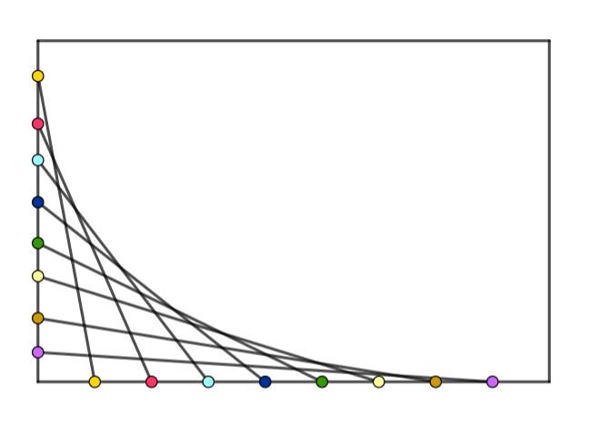
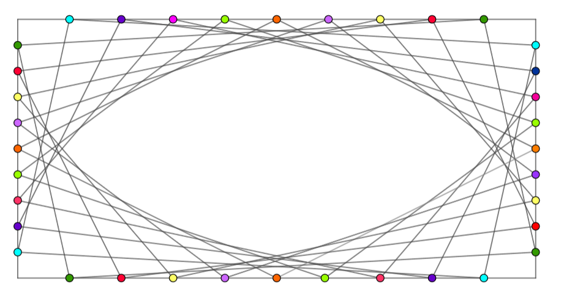

Цртање помоћу петљи - утврђивање
================================

На овом часу додатно увежбај цртање уз помоћ петљи тако што ћеш
урадити још неколико задатака из ове области. Не мораш да урадиш све
задатке, већ само одабери оне који ти се из неког разлога највише
допадају. Пожељно је да сваки задатак урадиш самостално, од почетка до
краја. Тек ако из више покушаја не успеш, онда потражи помоћ, па
покушај да допуниш код. Тек ако ни са започетим програмом не можеш да 
решиш задатак, погледај решење.

Задаци
------

Испрекидана линија
''''''''''''''''''

.. questionnote::

   Напиши програм који по средини прозора исцртава испрекидану линију
   код које је свака линијица обојена насумично одабраном
   бојом. Дужине линијица и размак између њих су једнаки 30 пиксела, а
   дебљина линије је 5 пиксела.

.. activecode:: isprekidana_linija
   :playtask:
   :help:
   :nocodelens:
   :modaloutput: 
   :enablecopy:
   :includexsrc: _includes/isprekidana_linija.py

   # funkcija koja gradi nasumično odabranu boju
   def nasumicnaBoja():
       return [???, ???, ???]
    
   # bojimo pozadinu u belo
   prozor.fill(pg.Color("white"))
    
   # dužina jednog podeoka je 30 piksela
   podeok = 30
    
   # sredina prozora
   sredina = ??? / 2

   # dok god levi kraj linije ne ispadne van prozora
   x = 0
   ??? x < sirina:
       # crtamo linijicu
       pg.draw.line(prozor, ???, (x, sredina), (???, sredina), 5)
       # pomeramo se za dužinu linije i dužinu razmaka
       x += ???

Црта-тачка линија
'''''''''''''''''

.. questionnote::

   Напиши програм који црта зелену испрекидану линију "црта-тачка".

.. activecode:: crta_tacka
   :playtask:
   :help:
   :nocodelens:
   :modaloutput: 
   :enablecopy:
   :includexsrc: _includes/isprekidana_linija_crta_tacka.py

   # funkcija koja gradi nasumično odabranu boju
   def nasumicnaBoja():
       return [random.randint(0, 255), random.randint(0, 255), random.randint(0, 255)]
    
   # bojimo pozadinu u belo
   prozor.fill(pg.Color("white"))
    
   # dužina jednog podeoka
   kratka_linija = 10
   duga_linija = 30
   razmak = 10
    
   # sredina prozora
   sredina = ???
    
   # da li se crta duga ili kratka linija
   duga = ???
   # koordinata pocetka linije
   x = 0
   # dok god linija pocinje unutar prozora
   while ???:
       # odredjujemo dužinu linije
       d = duga_linija if ??? else kratka_linija
       # crtamo liniju
       pg.draw.line(prozor, pg.Color("green"), (???, sredina), (???, sredina), 5)
       # pocetak naredne linije
       x += ???
       # naredna linija menja dužinu u odnosu na tekuću
       duga = ??? duga
		 

Шпартање дијагоналама
'''''''''''''''''''''

У једном од претходних задатака шпартали смо прозор водоравним и
усправним линијама. Тада смо видели да се крајње тачке тих линија
налазе на ободу прозора и имају координате облика :math:`(i\cdot d_x,
0)`, :math:`(i\cdot d_x, v)`, :math:`(0, i\cdot d_y)` и :math:`(s, i\cdot
d_y)`, где су :math:`d_x` и :math:`d_y` хоризонтално тј. вертикално
растојање између две линије, док су :math:`s` и :math:`v` ширина
тј. висина прозора. Ако употребимо исте тачке, али их спојимо дужима
на мало другачији начин, можемо добити веома интересантне шаре.

.. questionnote::

   Напиши програм који дијагонално шпарта прозор у правцу споредне
   дијагонале. Број линија изнад споредне дијагонале (укључујући и њу)
   је :math:`n=10` (исто важи и за број линија испод споредне
   дијагонале).

Крајње тачке ових дужи деле сваку од ивица прозора на по :math:`n`
једнаких делова. Стога се растојање :math:`d_x` између суседних тачака
на горњој (и доњој) ивици прозора може израчунати дељењем ширине, а
растојање :math:`d_y` између суседних тачака на левој (и десној) ивици
дељењем висине прозора бројем :math:`n`. Посматрајмо дужи које спајају
леву и горњу ивицу прозора (последња таква је споредна
дијагонала). Прва дуж спаја тачке са координатама :math:`(d_x, 0)` и
:math:`(0, d_y)`, друга дуж тачке са координатама :math:`(2 d_x,
0)` и :math:`(0, 2 d_y)` итд. Дакле, те дужи можемо нацртати тако
што у петљи у којој бројачка променљива ``i`` мења вредности од 1 до
``n`` цртамо дужи које спајају тачке са координатама ``(i*dx, 0)`` и
``(0, i*dy)``. Слично, прва дуж испод дијагонале спаја тачке са
координатама :math:`(w, d_y)` и :math:`(d_x, h)`, друга тачке са
координатама :math:`(w, 2 d_y)` и :math:`(2 d_x, h)` итд.,
где :math:`w` означава ширину, а :math:`h` висину прозора. Дакле, те
дужи можемо нацртати тако што у петљи у којој бројачка променљива
``i`` мења вредности од 1 до ``n-1`` цртамо дуж која спаја тачке са
координатама ``(sirina, i*dy)`` и ``(i*dx, visina)``.

На основу претходне дискусије напиши наредни програм.
   
.. activecode:: dijagonalno_spartanje
   :playtask:
   :help:
   :nocodelens:
   :modaloutput: 
   :enablecopy:
   :includexsrc: _includes/dijagonalno-spartanje.py

   # bojimo pozadinu prozora u belo
   prozor.fill(???)
    
   # broj podeoka
   n = 10
   # prirastaj
   dx = sirina / n
   dy = visina / n
    
   # crtamo n linija iznad sporedne dijagonale (uključujuci i nju)
   for i in range(n + 1):
       pg.draw.line(prozor, pg.Color("black"), (0, i*dy), (???, ???), 1)
       
   # crtamo n-1 linija ispod sporedne dijagonale (bez nje)
   for i in range(1, n):
       pg.draw.line(prozor, pg.Color("black"), (i*dx, ???), (???, i*dy), 1)

   
Програм се може мало једноставније написати ако се не обазиремо на то
да крајње тачке дужи изађу ван граница прозора.
   
.. activecode:: spartanje_dijagonale_van_prozora
   :passivecode: true

   # crtamo linije i van granica prozora, računajuci da se deo linija
   # koji ne pripada prozoru neće ni videti
   for i in range(2*n):
       pg.draw.line(prozor, CRNA, (0, i*dy), (i*dx, 0), 1)

.. questionnote::

   Ажурирај претходни програм тако да се додају и дијагонале паралелне
   главној дијагонали исцртане црвеном бојом.

.. activecode:: dijagonalno-spartanje-2
   :playtask:
   :help:
   :nocodelens:
   :modaloutput: 
   :enablecopy:
   :includexsrc: _includes/dijagonalno-spartanje-2.py

   prozor.fill(pg.Color("white"))
    
   # broj podeoka
   n = 10
   # prirastaj
   dx = sirina / n
   dy = visina / n

   # crtamo n linija iznad sporedne dijagonale (uključujući i nju)
   for i in range(n + 1):
       pg.draw.line(prozor, pg.Color("black"), (0, i*dy), (i*dx, 0), 1)
       
   # crtamo n-1 linija ispod sporedne dijagonale (bez nje)
   ???

   # crtamo n linija ispod glavne dijagonale (uključujuci i nju)
   ???

   # crtamo n-1 linija iznad glavne dijagonale (bez nje)
   ???

Шарање ротираним дужима
'''''''''''''''''''''''
   
.. questionnote::

   Напиши програм који исцртава шару по прозору која је креирана од
   дужи, како је приказано на слици.

Иако шара изгледа на први поглед прилично различито, овај програм је
заправо прилично сличан претходном. Прва дуж спаја тачке се
координатама :math:`(0, d_y)` и :math:`(d_x, h)`, друга спаја тачке са
координатама :math:`(0, 2d_y)` и :math:`(2d_x, h)`, итд., све до дужи
која спаја тачке :math:`(0, (n-1)\cdot d_y)` и :math:`((n-1)\cdot d_x,
h)`, где је :math:`h` висина прозора. Дакле, дужи можемо нацртати у
петљи у којој се бројачка променљива ``i`` креће од ``1`` до ``n-1``,
у чијем телу цртамо дуж која спаја тачке са координатама ``(0, i*dy)``
и ``(i*dx, visina)``. Ако би се бројач у петљи мењао од ``0`` до
``n``, тада би се цртале и прва вертикална и последња хоризонтална дуж
(oне се не виде, јер се поклапају са ивицама прозора).

На основу претходне дискусије допуни наредни програм.

.. activecode:: rotirane_duzi
   :playtask:
   :help:
   :nocodelens:
   :modaloutput: 
   :enablecopy:
   :includexsrc: _includes/rotirane-duzi.py

   prozor.fill(pg.Color("white"))
    
   # broj podeoka
   n = 10
   # priraštaj
   dx = sirina / n
   dy = visina / n

   # crtamo n linija u donjem levom uglu prozora 
   for i in range(1, n):
       pg.draw.line(prozor, pg.Color("black"), (???, ???), (???, ???), 1)
   
.. questionnote::

   Допуни претходни програм тако да се сличан шаблон понавља у сва
   четири угла прозора, како је приказано на слици.

Пажљиво анализирај координате крајњих тачака дужи, уочи правилности,
експериментиши и покушај тако да дођеш до решења.
	   
.. activecode:: rotirane_duzi2
   :nocodelens:
   :playtask:
   :help:
   :modaloutput: 
   :enablecopy:
   :includexsrc: _includes/rotirane-duzi2.py

   prozor.fill(pg.Color("white"))
    
   # broj podeoka
   n = 10
   # prirastaj
   dx = sirina / n
   dy = visina / n

   # crtamo n linija u donjem levom uglu prozora 
   for i in range(n + 1):
       pg.draw.line(prozor, pg.Color("black"), (0, i*dy), (i*dx, visina), 1)

   # crtamo n linija u gornjem desnom uglu prozora
   ???
   
   # crtamo n linija u gornjem levom uglu
   ???
   
   # crtamo n linija u donjem desnom uglu
   ???
   
.. reveal:: rotirane_duzi_4ugla_resenje
   :showtitle: Прикажи решење
   :hidetitle: Сакриј решење

   Решење се може добити на следећи начин.

   .. activecode:: rotirane_duzi_4ugla_resenje_kod
      :passivecode: true

      # crtamo n linija u donjem levom uglu prozora 
      for i in range(n + 1):
          pg.draw.line(prozor, pg.Color("black"), (0, i*dy), (i*dx, visina), 1)
      # crtamo n linija u gornjem desnom uglu prozora
      for i in range(n + 1):
          pg.draw.line(prozor, pg.Color("black"), (i*dx, 0), (sirina, i*dy), 1)
      # crtamo n linija u gornjem levom uglu
      for i in range(n + 1):
          pg.draw.line(prozor, pg.Color("black"), (i*dx, 0), (0, visina-i*dy), 1)
      # crtamo n linija u donjem desnom uglu
      for i in range(n + 1):
          pg.draw.line(prozor, pg.Color("black"), (i*dx, visina), (sirina, visina-i*dy), 1)                

Крешендо
''''''''   
.. questionnote::

   Напиши програм који исцртава 100 паралелних вертикалних линија
   равномерно распоређених ширином прозора, тако да дужина тих линија
   равномерно расте од нуле па до висине прозора.

   
.. activecode:: kresendo
   :nocodelens:
   :modaloutput: 
   :enablecopy:
   :playtask:
   :help:
   :includexsrc: _includes/kresendo.py

   # boje koje ćemo koristiti
   PLAVA = (100, 100, 255)
   BELA = (255, 255, 255)

   # bojimo pozadinu prozora u belo
   prozor.fill(BELA)

   # broj linija koje se crtaju
   brojLinija = 100
   # razmak između linija
   razmak = ???
   # razlika u visini između susednih linija
   prirastaj = ???
   # vertikalna sredina prozora
   sredina = visina / 2

   # horizontalna pozicija tekuće linije
   polozaj = 0
   # dužina tekuće linije
   duzina = 0
   # crtamo jednu po jednu liniju
   for i in range(brojLinija):
       # pola dužine se nalazi iznad, a pola dužine ispod sredine prozora
       pg.draw.line(prozor, PLAVA, (polozaj, ???), (polozaj, ???), 3)
       # povećavamo dužinu linije
       duzina += prirastaj
       # pomeramo se horizontalno udesno
       polozaj += razmak

Лоптице
'''''''

.. questionnote::

   Напиши програм који исцртава лоптице хоризонтално распоређене по
   средини висине прозора, које се међусобно додирују, тако да је полупречник
   прве 10 пиксела, а полупречник сваке наредне за 10 пиксела већи од
   претходне. Лоптице су наизменично црвене, зелене, плаве и жуте боје
   (и тако у круг).
   
.. activecode:: loptice.py
   :playtask:
   :help:
   :nocodelens:
   :modaloutput: 
   :enablecopy:
   :includexsrc: _includes/loptice.py

   # boje koje cemo koristiti
   CRVENA = (???, ???, ???)
   ZELENA = (0, 255, 0)
   PLAVA = (0, 0, 255)
   ZUTA = (???, ???, ???)
   BELA = (255, 255, 255)
    
   prozor.fill(BELA)
    
   # vertikalna sredina prozora
   sredina = ???
    
   # lista boja koje se naizmenicno smenjuju
   boje = [CRVENA, ZELENA, PLAVA, ZUTA]
   # redni broj kruga
   i = 0
   # poluprečnik kruga
   r = 10
   # položaj levog kraja kruga
   x = 0
   # dok god levi kraj kruga ne ispadne van prozora
   while x <= sirina:
       # crtamo krug - boja je odredjena na osnovu rendog broja i
       pg.draw.circle(prozor, ???, (???, ???), r)
       # izračunavamo položaj levog kraja narednog kruga
       x += ???
       # povećavamo poluprečnik narednog kruga
       r += 10
       # ažuriramo redni broj kruga
       i += 1       

Згуснуте линије
'''''''''''''''

.. questionnote::

   Нацртај цртеж у ком се 10 усправних линија удаљава једна од друге за размак који је 10% већи од размака претходне две линије. Линије се удаљавају како се
   померамо ка десној страни прозора. Размак између прве две линије је 20 пискела.

.. activecode:: zgusnute_linije
   :playtask:
   :help:
   :nocodelens:
   :modaloutput: 
   :enablecopy:
   :includexsrc: _includes/zgusnute_linije.py

   # bojimo pozadinu prozora u crno
   prozor.fill(pg.Color("black"))
    
   # y koordinate krajeva linija
   y0 = 50
   y1 = visina - 50
   # tekuća koordinata x
   x = 50
   # tekući razmak između dve linije
   dx = 20
   # 10 puta ponavljamo
   for i in range(10):
       # crtamo tekuću liniju
       pg.draw.line(???, ???, ???, ???);
       # izračunavamo položaj sledeće na osnovu tekućeg razmaka
       ???
       # uvećavamo razmak za 10 posto
       ???      

Цигле
'''''

Редови цигала наизменично почињу целом циглом и половином цигле. Нека
је ширина цигле означена са :math:`s`, а њена висина са
:math:`v`. Целу циглу на почетку реда добијамо тако што цртамо
правоугаоник од тачке на датој висини, са :math:`x` координатом
једнаком нули. Половину цигле на почетку реда можемо да добијемо тако
што нацртамо целу циглу померену за :math:`s \over 2` улево, то јест
тако што цртамо правоугаоник од такче на истој висини, али са
:math:`x` координатом једнаком ``-s // 2``. Тако постижемо да се види
само десна половина цигле. Остаје да решимо када цртамо померену циглу
а када не.

Једно решење је да место почетка реда цигала чувамо у променљивој,
назовимо је ``x_poc``. После сваког исцртаног реда, проверавамо да ли
променљива ``x_poc`` има вредност нула или :code:`-s // 2`. Коју год
од ове две вредности променљива имала, доделићемо јој ону другу
вредност, да би у следећем реду цртање цигала почело другачије.

Нагласимо да корак у петљи мора бити целобројна вредност тако да пола
ширине цигле морамо израчунати целобројним дељењем.

.. activecode:: PyGame_loops_bricks1
    :nocodelens:
    :enablecopy:
    :modaloutput:
    :playtask:
    :help:
    :includexsrc: _includes/cigle.py

    prozor.fill(pg.Color("red"))
    (s_cigle, v_cigle) = (80, 40)
    x_poc = 0
    for y0 in range(0, visina, v_cigle): # Za svaki red cigala
        for x0 in range(x_poc, sirina, s_cigle): # Za svaku ciglu u redu
            pg.draw.rect(prozor, pg.Color("black"), (x0, y0, s_cigle, v_cigle), 1)
            
        if x_poc == ???:
            x_poc = -s_cigle//2
        else:
            x_poc = ???

Тараба
''''''

.. questionnote::

   Напиши програм који црта сеоску ограду (тарабу).

Сваку притку ограде представићемо у облику многоугла. Да бисмо притке
могли да цртамо на различитим позицијама, потребно је да координате
тог многоугла буду задате релативно. Пошто ће све притке бити увек на
истој висини (истој :math:`y` координати), довољно је да притке буду
параметризоване једним параметром - координатом :math:`x` левог краја притке.
   
Један начин је да у задавању темена притке користимо променљиву ``x``,
која се мења у петљи. Када би се притке померале и на горе или на
доле, онда би у задавању темена учествовала и променљива *y*.

.. activecode:: ograda_1nacin
   :passivecode: true

   for x in range(20, 300, 40):
       pg.draw.polygon(prozor, pg.Color('brown'),
                       [(x, 80), (x + 10, 70), (x + 20, 80), (x + 20, 270), (x, 270)])

Можемо и да уведемо функцију која црта притку у односу на њену
релативно задату :math:`x` координату.

.. activecode:: ograda_2nacin
   :passivecode: true

   def pritka(x):
       temena = [(x, 80), (x+10, 70), (x+20, 80), (x+20, 270), (x, 270)]
       pg.draw.polygon(prozor, boja, temena)

   for x in range(20, 300, 40):
       pritka(x)

Још једна могућност је да приликом цртања пресликамо координате
основне листе (коришћењем компрехенсије тј. скуповне нотације за
листе).

.. activecode:: ograda_3nacin
   :passivecode: true

   temena = [(20, 80), (30, 70), (40, 80), (40, 270), (20, 270)]
   for i in range(7):
       pg.draw.polygon(prozor, pg.Color('brown'), [(x + 40*i, y) for (x,y) in temena])

Коришћењем било ког од наведених решења нацртај тарабу.
        
.. activecode:: PyGame_loops_fence
    :nocodelens:
    :enablecopy:
    :modaloutput:
    :playtask:
    :includexsrc: _includes/taraba.py

    ???
