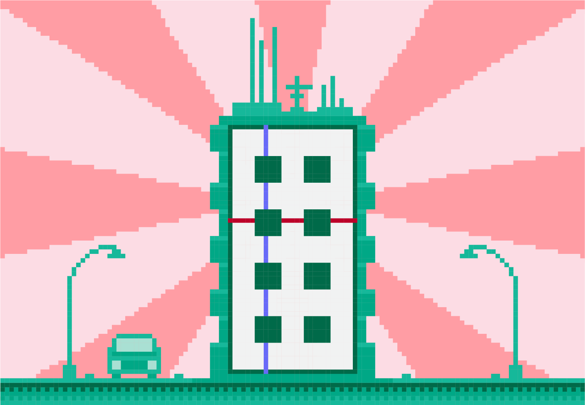

Цртање помоћу петљи - угњежђене петље
=====================================

Плесни подијум
''''''''''''''

.. questionnote::

   Плесни подијуми 1970-их су били издељени на квадратне плоче које су
   могле да светле у различитим бојама. Прикажи један такав подијум
   (гледан одозго) тако што ћеш поделити екран на :math:`n \times n`
   квадрата и сваки квадрат обојити у насумичну боју.

   
Претпоставићемо да на располагању имамо функцију која на насумичан
начин одабире боју (њу је веома једноставно испрограмирати коришћењем
функције ``random.randint``). Угнежђеним петљама ћемо набрајати све
парове :math:`(0, 0)`, :math:`(0, 1)`, ..., :math:`(0, n-1)`,
:math:`(1, 0)`, ..., :math:`(1, n-1)`, ..., :math:`(n-1, 0)`, ...,
:math:`(0, n-1)`. Задатак се онда своди на то да одредимо горње лево
теме квадрата који се налази у врсти са редним бројем :math:`i` и
колони са редним бројем :math:`j`. Пошто се лево од тог квадрата
налази тачно :math:`j` квадрата, док се изнад њега налази тачно
:math:`i` квадрата, координате његовог горњег левог темена су
:math:`(j*a, i*a)`. На основу овога лако можеш допунити наредни код.
   
.. activecode:: podijum
   :playtask:
   :nocodelens:
   :modaloutput: 
   :enablecopy:
   :includexsrc: _includes/podijum.py

   def nasumicna_boja():
       return (random.randint(0, 255), random.randint(0, 255), random.randint(0, 255))
    
   # broj kvadrata
   broj_kvadrata = 8
   # dimenzija kvadrata
   a = sirina / broj_kvadrata
    
   # prolazimo kroz sva polja
   for i in range(broj_kvadrata):
       for j in range(broj_kvadrata):
           pg.draw.rect(prozor, nasumicna_boja(), ???)

       
Сивкасти насумични кружићи
''''''''''''''''''''''''''
   
.. questionnote::

   Напиши програм који исцртава мрежу правилно распоређених кружића,
   при чему се пречник и нијанса сиве боје кружића насумично одређује.

Овај задатак је сличан претходном, једино што су нам уместо горњих
левих темена сваког поља потребне координате центра сваког поља.  За
свако поље насумично генеришемо полупречник (цео број из интервала
:math:`[2, d]`), нијансу сиве боје (цео број из интервала :math:`[0,
255]`) и на основу боје, координата центра и полупречника вршимо
цртање круга. Подсетимо се, за насумични одабир целог броја из
интервала :math:`[a, b]` користимо функцију ``random.randint(a, b)``.

Покушај да самостално урадиш овај задатак. Ако не успеваш, онда
искористи понуђену помоћ, па допуни започети програм.

.. activecode :: nasumični_kruzici
   :playtask:
   :help:
   :nocodelens:
   :modaloutput: 
   :enablecopy:
   :includexsrc: _includes/kruzici.py

   # bojimo pozadinu prozora u belo
   prozor.fill(pg.Color("white"))
    
   # Maksimalni poluprečnik kružića
   r_max = 10
   # rastojanje izmedju vrsta i kolona
   d = 2 * r_max
    
   # indeksi kolona
   for i in range(???):
       # indeksi vrsta
       for j in range(???):
           # centar kruga u koloni i, vrsti j 
           (cx, cy) = (???, ???)
           # nasumično određujemo poluprečnik (maksimalni poluprečnik je r_max)
           r = random.randint(2, ???)
           # nasumično određujemo nijansu sive boje
           b = random.randint(0, 255)
           boja = [???, ???, ???]
           # crtamo krug
           pg.draw.circle(prozor, boja, (cx, cy), r)
           
           
Зграда
''''''
.. questionnote::

   Напиши програм који исцртава прозоре на згради која има дати број
   спратова и дати број вертикала.

Зграда коју треба да нацртамо је приказана на наредној слици.
   

Зеленом бојом су означени међуспратови, укључујући и простор испод
првог спрата и изнад последњег спрата, док су црвеном бојом означене
међувертикале, укључујући и простор лево од прве и десно од последње
вертикале. Видимо да је број међуспратова за један већи од броја
спратова, док је број међувертикала за један већи од броја
вертикала. Претпоставићемо да је висина сваког прозора иста као висина
сваког међуспрата и да је ширина сваког прозора једнака ширини сваке
међувертикале. Одавде можемо израчунати висину прозора зграде (тако
што укупну висину поделимо са збиром броја спратова и међуспратова) и
ширину прозора зграде (тако што укупну ширину поделимо са збиром
вертикала и међувертикала). Прозоре можемо цртати од горе на доле
(иако се спратови увек броје од доле на горе). Координате горњег левог
темена прозора у врсти :math:`i` и колони :math:`j` можемо добити тако
што на ширину међувертикале додамо :math:`j` пута збир ширине прозора
и ширине међувертикале (што је у нашем случају једнако двострукој
ширини прозора) тј. тако што на ширину међуспрата додамо :math:`i`
пута збир висине спрата и висине међуспрата (што је у нашем случају
једнако двострукој ширини међуспрата).

Покушај да на основу претходне дискусије самостално урадиш овај
задатак. Ако не успеваш, онда искористи понуђену помоћ, па допуни
започети програм.
   
.. activecode:: zgrada
   :playtask:
   :help:
   :nocodelens:
   :modaloutput: 
   :enablecopy:
   :includexsrc: _includes/zgrada.py

   # bojimo pozadinu prozora u belo
   prozor.fill(pg.Color("white"))
    
   # broj spratova
   brojSpratova = 4
   # broj međuspratova, računajući i prizemlje i potkrovlje
   brojMedjuSpratova = ???
   # broj vertikala u zgradi
   broj_vertikala = 2
   # broj međuvertikala, računajući i prvu i poslednju
   brojMedju_vertikala = ???
    
   # visina prozora je jednaka visini međusprata
   visina_prozora = visina / (???)
   # širina prozora je jednaka širini međuvertikale
   sirina_prozora = sirina / (???)
    
   # iscrtavamo konturu zgrade
   pg.draw.rect(prozor, pg.Color("blue"), (0, 0, sirina, visina), 10)
    
   # crtamo prozore
    
   # obradjujemo sprat po sprat
   for i in range(brojSpratova):
       # za svaki sprat obradjujemo vertikalu, po vertikalu
       for j in range(broj_vertikala):
           # crtamo prozor
           prozor_x = sirina_prozora + ???
           prozor_y = visina_prozora + ???
           pg.draw.rect(prozor, pg.Color("blue"), (prozor_x, prozor_y, sirina_prozora, visina_prozora))

Уместо петљи у којима се редом наводе редни бројеви, могли смо
употребити и петље са кораком.

.. activecode:: ugnezdjene_sa_korakom
   :passivecode: true

   for x in range(sirina_prozora, sirina, 2*sirina_prozora):
       for y in range(visina_prozora, visina, 2*visina_prozora):
          ...

Покушај сада да прилагодиш претходни програм тако да висина међуспрата
буде само пола висине спрата.
