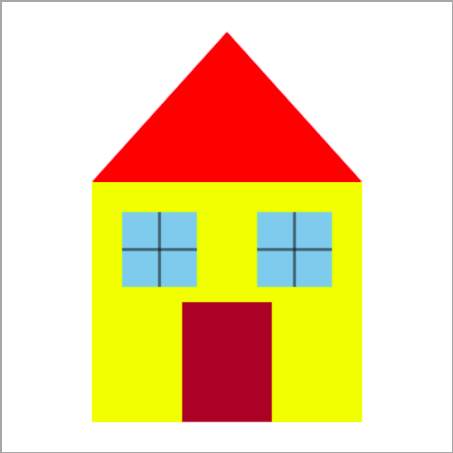

Пројекат - Кућица
'''''''''''''''''

.. questionnote::

   Циљ овог пројекта је да направимо програм који црта
   кућицу. Приликом цртања кућице применићемо знање о израчунавању
   координата. Да би лакше дошли до крајњег решења, одговори на
   наредни низ питања која се сва односе на цртеж кућице.

.. fillintheblank:: pygame_quiz_house_1

    Основу кућице чини жути правоугаоник ширине 180 и висине 160
    пиксела. Ако је прозор у коме се црта димензије 300 пута 300
    пиксела, ако је испод кућице остављена маргина од 20 пиксела и ако
    је правоугаоник хоризонтално центриран унутар прозора, кoje су
    координате горњег левог угла жутог правоугаоника (напиши их у
    облику уређеног пара)?

    - :\(60,[ ]*120\): Тачно!
      :\(60,[ ]*[0-9]+\): Пажљивије израчунај координату y.
      :\([0-9]+,[ ]*120\): Пажљивије израчунај координату x.
      :\([0-9]+,[ ]*[0-9]+\): Пажљивије израчунај обе координате.
      :.*: Резултат запиши у облику уређеног пара.

.. fillintheblank:: pygame_quiz_house_2

    Изнад врха крова остављена је маргина од 20 пиксела. Које су координате
    тачке на којој се налази врх крова?

    - :\(150,[ ]*20\): Тачно!
      :\(150,[ ]*[0-9]+\): Пажљивије израчунај координату y.
      :\([0-9]+,[ ]*20\): Пажљивије израчунај координату x.
      :\([0-9]+,[ ]*[0-9]+\): Пажљивије израчунај обе координате.
      :.*: Резултат запиши у облику уређеног пара.

.. mchoice:: pygame_quiz_house_3
   :multiple_answers:
   :answer_a: [(120, 60), (20, 150), (120, 240)])
   :answer_b: [(150, 20), (60, 120), (240, 120)])
   :answer_c: [(60, 120), (150, 20), (180, 160)])
   :answer_d: [(60, 120), (150, 20), (240, 120)])
   :correct: b, d
   :feedback_a: Покушај поново
   :feedback_b: Тачно
   :feedback_c: Покушај поново
   :feedback_d: Тачно
   
   Кров је нацртан у облику испуњеног многоугла (тј. троугла).  Чиме
   се може допунити наредба за исцртавање `pg.draw.polygon(prozor,
   pg.Color("red"), ???)` да би се нацртао кров.

.. fillintheblank:: pygame_quiz_house_4

    Леви и десни прозор су распоређени симетрично. Које су координате горњег
    левог угла десног прозора, ако је леви прозор исцртан наредбом
    `pg.draw.rect(prozor, pg.Color("skyblue"), (80, 140, 50, 50))`.

    - :\(170,[ ]*140\): Тачно!
      :\(170,[ ]*[0-9]+\): Пажљивије израчунај координату y.
      :\([0-9]+,[ ]*140\): Пажљивије израчунај координату x.
      :\([0-9]+,[ ]*[0-9]+\): Пажљивије израчунај обе координате.
      :.*: Резултат запиши у облику уређеног пара.
           
.. mchoice:: pygame_quiz_house_5
   :multiple_answers:
   :answer_a: Координату x можемо израчунати тако што од координате центра
              кућице (150) одузмемо пола ширине врата (60:2 = 30) и тако
              добијемо 120.
   :answer_b: Координату y можемо израчунати тако што од координате дна
              кућице (а то је 300 - 20 = 280) одузмемо висину врата (80) и
              тако добијемо 200.
   :answer_c: Координату x можемо израчунати тако што на координату леве
              ивице кућице (а то је 150 - 180:2 = 60) додамо ширину врата (60)
              и тако добијемо 120.
   :answer_d: Координату x можемо израчунати тако што на координату леве
              ивице кућице (а то је 150 - 180:2 = 60) додамо половину разлике
              између ширине кућице и ширине врата (а то је (180-60):2 = 60)
              и тако добијемо 120.
   :correct: a, b, d
   :feedback_a: Покушај поново
   :feedback_b: Покушај поново
   :feedback_c: Тачно
   :feedback_d: Покушај поново

   Врата димензије 60 пута 80 пиксела су постављена симетрично у односу на
   средину кућице. Како се може израчунати положај горњег левог темена
   врата? Означи све поступке који су тачни.

.. mchoice:: pygame_quiz_house_6
   :answer_a: pg.draw.line(prozor, pg.Color("black"), (80, 165), (130, 165))
   :answer_b: pg.draw.line(prozor, pg.Color("black"), (105, 140), (105, 190))
   :answer_c: pg.draw.line(prozor, pg.Color("black"), (195, 140), (195, 190))
   :answer_d: pg.draw.line(prozor, pg.Color("black"), (170, 165), (220, 165))
   :correct: d
   :feedback_a: Покушај поново
   :feedback_b: Покушај поново
   :feedback_c: Покушај поново
   :feedback_d: Тачно

   Која од наредних наредби исцртава хоризонталну линију на десном прозору.

.. mchoice:: pygame_quiz_house_7
   :multiple_answers:
   :answer_a: Координата x леве тачке дужи једнака је координати y
              леве ивице прозора (80), а координата x десне тачке
              дужи једнака је координати x десне ивице прозора (80 +
              50 = 130).
   :answer_b: Координата x и горње и доње тачке дужи једнака је аритметичкој
              средини координата x леве ивице прозора (80) и десне ивице
              прозора (80 + 50 = 130), тј. једнака је (80 + 130) : 2 = 105.
   :answer_c: Координата x и горње и доње тачке дужи се може израчунати тако
              што се на координату x леве ивице прозора (80) дода пола
              ширине прозора (50:2 = 25).
   :answer_d: Координата y горње тачке дужи једнака је координати y
              горње ивице прозора (140), а координата y доње тачке
              дужи једнака је координати y доње ивице прозора (140 +
              50 = 190).
   :correct: b,c,d
   :feedback_a: Покушај поново
   :feedback_b: Тачно
   :feedback_c: Тачно
   :feedback_d: Тачно

   Желимо да нацртамо вертикалну црну дуж по средини левог прозора,
   који је нацртан као квадрат димензије :math:`50`, чије је горње
   лево теме у :math:`(80, 140)`. Означи тврђења која исправно
   одређују координате те дужи.

   
На основу свега реченог можеш и да нацрташ кућицу.

.. activecode:: PyGame_house
   :nocodelens:
   :enablecopy:
   :modaloutput:
   :playtask:
   :includexsrc: _includes/kucica.py

   # osnova kuće
   # krov
   # levi prozor
   # desni prozor
   # vrata
   
.. reveal:: kucica_reveal
   :showtitle: Прикажи решење
   :hidetitle: Сакриј решење

   .. activecode:: kucica_reveal_code
      :passivecode:

      # osnova kuće
      pg.draw.rect(prozor, pg.Color("yellow"), (60, 120, 180, 160))
      # krov
      pg.draw.polygon(prozor, pg.Color("red"), [(60, 120), (150, 20), (240, 120)])
      # levi prozor
      pg.draw.rect(prozor, pg.Color("skyblue"), (80, 140, 50, 50))
      pg.draw.line(prozor, pg.Color("black"), (80, 165), (130, 165))
      pg.draw.line(prozor, pg.Color("black"), (105, 140), (105, 190))
      # desni prozor
      pg.draw.rect(prozor, pg.Color("skyblue"), (170, 140, 50, 50))
      pg.draw.line(prozor, pg.Color("black"), (170, 165), (220, 165))
      pg.draw.line(prozor, pg.Color("black"), (195, 140), (195, 190))
      # vrata
      pg.draw.rect(prozor, pg.Color("brown"), (120, 200, 60, 80))
