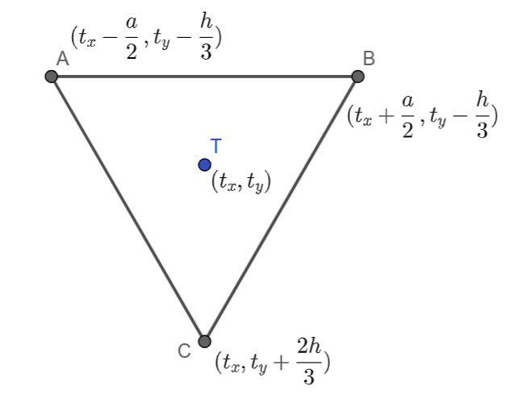

Час 6 - релативне координате - утврђивање
=========================================

На прошлом часу смо се упознали са релативно задатим координатама и
предностима тог механизма цртања. Утврдимо ово кроз још неколико
примера.

Кућа - положај
''''''''''''''

Рецимо да сте написали овај програм, а циљ вам је да преправите
програм тако да кућица може једноставно да се премешта:

.. activecode:: PyGame_house_detailed_fixed
    :nocodelens:
    :enablecopy:
    :modaloutput:
    :includesrc: _includes/kuca_2d_apsolutno.py

Нека је главна тачка (сидро) :code:`(x, y) = (50, 150)`. Довршите
започето преправљање програма у пољу испод, у коме се цртање обавља у
функцији :code:`kuca(x, y, boja_zidova)`. Када се уверите да цртежи у
два програма изгледају исто (осим што су прозори различите величине),
замените позив :code:`kuca(50, 150, pg.Color("khaki"))` са следећа 4,
да бисте добили слику као кад се кликне на дугме "Прикажи пример":

.. code::

    kuca(150,  90, pg.Color(220, 220, 220))
    kuca(220, 130, pg.Color("white"))
    kuca(350, 160, (255,255,150))
    kuca( 50, 150, pg.Color("khaki"))

.. activecode:: PyGame_house_detailed_movable
    :nocodelens:
    :enablecopy:
    :modaloutput:
    :playtask: 
    :includexsrc: _includes/kuca_2d_relativno.py
   
    prozor.fill(pg.Color("darkgreen")) # bojimo pozadinu ekrana u tamno zeleno

    def kuca(x, y, boja_zidova):
        pg.draw.polygon(prozor, pg.Color("red"), [(x, y), (x+???, y-???), (x+140, y)]) # krov
        pg.draw.rect(prozor, boja_zidova,       (x,       y,     140, 100))   # kuca
        pg.draw.rect(prozor, pg.Color("brown"), (x + ???, y + ???,  30,  30)) # levi prozor
        pg.draw.rect(prozor, pg.Color("brown"), (x + ???, y + ???, ???, ???)) # desni prozor
        pg.draw.rect(prozor, pg.Color("brown"), (x + ???, y + ???, ???, ???)) # vrata
        
    kuca( 50, 150, pg.Color("khaki"))

Саобраћајни знак од једнакостраничних троуглова
'''''''''''''''''''''''''''''''''''''''''''''''

.. questionnote::

   Напиши програм који исцртава саобраћајни знак укрштања са путем са
   првенством пролаза који је у облику жутог једнакостраничног троугла
   са црвеном ивицом, окренутог тако да му је хоризонтална основица
   горе.

Ефекат троугла који је жуте боје и има дебелу црвену ивицу постићи
ћемо тако што ћемо нацртати прво већи црвени троугао, а затим мањи
жути троугао. Та два троугла ћемо поставити тако да им се тежишта
(уједно и све значајне тачке) поклапају и да су идентично
оријентисани.
   
Приликом цртања саобраћајног знака потребно је да одредимо поступак
којим се црта једнакостранични троугао ако му је познато сидро
постављено у тежиште :math:`T` за које ћемо претпоставити да има
координате :math:`(t_x, t_y)` и ако му је позната димензија (то може
бити било дужина странице :math:`a`, било висина :math:`h`, јер се из
једне од ових димензија друга једноставно израчунава на основу чувене
везе :math:`h = \frac{a\sqrt{3}}{2}`, која се лако изводи применом
Питагорине теореме на правоугли троугао чија је једна катета висина
једнакостраничног троугла, друга половина странице, а хипотенуза је
страница једнакостраничног троугла).
   

Пошто, како из математике знамо, тежиште троугла дели тежишну дуж (у
овом случају то је уједно и висина) у односу :math:`2:1`, координате
темена :math:`A` и :math:`B` су у односу на ову тачку померене
(транслиране) на горе за :math:`\frac{1}{3}h`, док је тачка :math:`C`
померена на доле за :math:`\frac{2}{3}h`.

Координате x ових тачака одређујемо у односу на тачку :math:`T`,
односно дужину странице :math:`a`. Тачка :math:`А` је померена од
тежишта за :math:`\frac{а}{2}` ка левој ивици прозора. Тачка :math:`В`
је померена од тежишта за :math:`\frac{а}{2}` средину ка десној
ивици. Тачка :math:`C` се хоризонално налази на линији тежишта.

Дакле, тачка :math:`A` има координате :math:`(t_x-\frac{a}{2},
t_y-\frac{h}{3})`, тачка :math:`B` има координате
:math:`(t_x+\frac{a}{2}, t_y-\frac{h}{3})`, док тачка :math:`C` има
координате :math:`(t_x, t_y+\frac{2h}{3})`.
    
Пошто је потребно да нацртамо два троугла, можемо дефинисати функцију
за цртање троугла и позвати је два пута (за исто тежиште, али
различите боје и димензије). Тежиште ћемо поставити хоризонтално на
средину прозора, док ћемо га вертикално поставити тако да троугао
делује центриран по средини екрана. Оставићемо простор (маргину) од по
30 пиксела изнад и испод троугла, а тежиште троугла ћемо поставити
тако да преосталу висину дели у односу 1:2.

На основу претходне дискусије допуни наредни програм.
	   
.. activecode:: obojeni_trougao
   :nocodelens:
   :modaloutput: 
   :enablecopy:
   :playtask:
   :includexsrc: _includes/saobracajni_znak_trougao.py

   def jedakostranicni_trougao(tx, ty, h, boja):
       a = h * 2 / math.sqrt(3)       # dužina stranice
       # koordinate temena - težiste deli visinu u odnosu 1 : 2
       A = (tx - a/2, ty - h/3)
       B = (???, ???)
       C = (???, ???)
       pg.draw.polygon(prozor, ???, ???)
   
   # bojimo pozadinu prozora u belo
   prozor.fill(pg.Color("white"))
   margina = 30
   h = visina - 2*margina
   (tx, ty) = (sirina / 2, margina + h / 3)
   jedakostranicni_trougao(tx, ty, h, pg.Color("red"))
   jedakostranicni_trougao(tx, ty, 0.65*h, pg.Color("yellow"))

Проблеми приликом израчунавања параметара кругова
=================================================

Подсетимо се да за разлику од функција за цртање линија и
правоугаоника које примају и реалне аргументе, функција за цртање
кругова захтева да су координате центра круга и дужина полупречника
искључиво цели бројеви. Ово може довести до одређених проблема у
програмима у којима се ти аргументи израчунавају у програму. Када
видиш поруку ``TypeError: integer argument expected, got float``, тада
знај да је проблем у томе што је функцији за цртање круга уместо целог
прослеђен неки реалан број и тај проблем можеш лако решити коришћењем
неког облика заокруживања бројева.

Зато ћемо често у задацима у којима цртамо кругове, за израчунавање
координата центара и полупречника кругова уместо реалног дељења
(оператора ``/``) користити целобројно дељење (оператор ``//``) или
ћемо користити заокруживање реалних бројева (функцијом ``round`` или
функцијом ``int``).

Провери да ли ово разумеш тако што ћеш одговорити на наредно питање.

.. mchoice:: pygame_quiz_greska_float
   :answer_a: Није наведен добар број параметара у позиву функције `pg.draw.circle`
   :answer_b: Координате центра не могу бити реални бројеви
   :answer_c: Редослед параметара у позиву није исправан
   :answer_d: Полупречник круга не сме да буде негативан број
   :answer_e: Потребно је навести још дебљину кружнице
   :correct: b
   :feedback_a: Покушај поново
   :feedback_b: Тачно
   :feedback_c: Покушај поново
   :feedback_d: Покушај поново
   :feedback_e: Покушај поново

   Након позива `pg.draw.circle(prozor, boja, (x, y), r)` пријављена
   је грешка `TypeError: integer argument expected, got float`. Шта
   може бити узрок те грешке?
   

Наредни програм црта цвет састављен од кругова, али не ради исправно и
твој задатак је да га поправиш.

Цвет
''''

.. questionnote::

   Напиши програм који исцртава цвет који се састоји од централног
   жутог круга пречника 100 пиксела, око којег се налази 6 правилно
   распоређених латица розе боје, свака у облику круга, такође
   пречника 100 пиксела (центри латица се налазе у теменима правилног
   шестоугла, чији је центар у центру цвета, а дужина странице је 100
   пиксела).

.. image:: ../../_images/roze_cvet.png
   :width: 500px   
   :align: center
   
За цртање круга потребно је знати координате центра и дужину
полупречника круга. Пречник свих кругова је једнак, самим тим и
полупречник :math:`r = \frac{a}{2}`.  Нека је тачка О центар жутог,
централног круга. Координате ове тачке означимо са :math:`(c_x,
c_y)`. Ова тачка се налази у центру прозора и њене координате једнаке
су половини висине, односно ширине прозора. Координате осталих
центара кругова изразићемо такође преко координата :math:`(c_x, c_y)`
.  Координате тачке :math:`А_1` означимо са :math:`(x_1, y_1)`. Тачка
:math:`А_1` је за :math:`a` померена (транслирана) од тачке О по оси
:math:`x`, тако да је :math:`x_1`, прва координата ове тачке једнака
:math:`x_1 = c_x + a`, а друга координата ове тачке :math:`y_1`
једнака је :math:`y` координати тачке О, тј. :math:`y_1 = c_y`.
Координате тачке :math:`А_2` означимо са :math:`(x_2, y_2)`. Ова тачка
је у односу на тачку О померена (транслирана) за :math:`\frac{a}{2}`
по оси :math:`x`, односно за висину :math:`h = \frac{a \sqrt{3}}{2}`
једнакостраничног троугла :math:`\triangle OA_1A_2` по оси `y`. На
основу овога закључујемо да су координате тачке :math:`А_2`,
:math:`(x_2, y_2) = (c_x+\frac{a}{2}, c_y + h)`.  Координате центра
осталих кругова одређујемо на сличан начин.

На основу претходне дискусије, допуни наредни програм и поправи
грешке везане за тип података бројева.
   
.. activecode:: cvet
   :nocodelens:
   :modaloutput: 
   :enablecopy:
   :playtask:
   :includexsrc: _includes/cvet.py

   # bojimo pozadinu u belo
   prozor.fill(BELA)

   # koordinate centra prozora
   (cx, cy) = (sirina / 2, visina / 2)

   # precnici krugova - duzina stranice pravilnog sestougla u cijim se
   # temenima nalaze centri krugova
   a = 100
   # visina karakteristicnog trougla sestougla
   h = a * math.sqrt(3) / 2

   # sva temena šestougla dele ove koordinate
   x1 = cx - a
   x2 = cx - a/2
   x3 = cx + a/2
   x4 = cx + a
   y1 = ???
   y2 = cy
   y3 = ???

   # koordinate temena šestougla
   O = (cx, cy)
   A1 = (x1, y2)
   A2 = (???, ???)
   A3 = (???, ???)
   A4 = (???, ???)
   A5 = (???, ???)
   A6 = (???, ???)

   # poluprecnik krugova
   r = a / 2

   # iscrtavamo krugove
   pg.draw.circle(prozor, ZUTA, O, r)
   pg.draw.circle(prozor, ROZE, A1, r)
   pg.draw.circle(prozor, ROZE, A2, ???)
   pg.draw.circle(prozor, ROZE, ???, ???)
   pg.draw.circle(prozor, ROZE, ???, ???)
   pg.draw.circle(prozor, ROZE, ???, ???)
   pg.draw.circle(prozor, ROZE, ???, ???)

Прелазак са апсолутних на релативне координате
==============================================

Иако цртеже који се задају у односу на неко сидро обично креирамо
имајући ово у старту у виду, постоји систематичан поступак којим од
цртежа који је задат у апсолутним координатама можемо доћи до цртежа
који је нацртан у односу на неко задато сидро (можемо *усидрити*
цртеж). Покушајмо да резимирамо како можемо да уведемо сидро тј. да од
цртежа у ком се јављају апсолутне координате уведемо релативне
координате.

На пример, ако се црта круг помоћу ``pg.draw.circle(prozor, boja, (cx,
cy), r)``, тада га можемо усидрити у тачку ``(x, y)`` тиме што позив
заменимо са ``pg.draw.circle(prozor, boja, (x + (cx - x), y + (cy -
y)), r)``. На пример, Ако круг нацртан помоћу ``pg.draw.circle(prozor,
boja, (100, 50), r)`` желимо да усидримо у тачку ``(x, y) = (50,
100)``, тада ћемо га цртати помоћу ``pg.draw.circle(prozor, boja, (x +
50, y - 50), r)``. Слично можемо урадити и у случају осталих облика.
   
Провери да ли ово разумеш тако што ћеш одговорити на наредних неколико
питања.
   
.. mchoice:: pygame_quiz_uvodjenje_sidra
   :multiple_answers:
   :answer_a: pg.draw.circle(prozor, pg.Color("red"), (x, y), 50, 1)
   :answer_b: pg.draw.line(prozor, pg.Color("red"), (x-50, x-50), (150, 150))
   :answer_c: pg.draw.line(prozor, pg.Color("red"), (x+50, y-50), (x-50, y+50))
   :answer_d: pg.draw.rect(prozor, pg.Color("red"), (x-50, y-50, x, y))
   :correct: a,c
   :feedback_a: Тачно
   :feedback_b: Покушај поново
   :feedback_c: Тачно
   :feedback_d: Покушај поново
   
   Желимо да прилагодимо цртеж који се састоји од наредних облика,
   тако да се све црта у односу на сидро са координатама `x=100`,
   `y=100`.
                
   .. activecode:: pygame_quiz_uvodjenje_sidra_code
      :passivecode: true
                    
      pg.draw.circle(prozor, pg.Color("red"), (100, 100), 50, 1)
      pg.draw.line(prozor, pg.Color("red"), (50, 50), (150, 150))
      pg.draw.line(prozor, pg.Color("red"), (150, 50), (50, 150))
      pg.draw.rect(prozor, pg.Color("red"), (50, 50, 100, 100))

   Које наредбе ће бити део прилагођеног цртежа?
      
.. mchoice:: pygame_quiz_uvodjenje_sidra_krug
   :answer_a: pg.draw.circle(prozor, pg.Color("red"), (x, y), 60)
   :answer_b: pg.draw.circle(prozor, pg.Color("red"), (180, 240), 60)
   :answer_c: pg.draw.circle(prozor, pg.Color("red"), (100, 100), 60)
   :answer_d: pg.draw.circle(prozor, pg.Color("red"), (x + 80, y - 20), 60)
   :answer_e: pg.draw.circle(prozor, pg.Color("red"), (x + 180 , y + 240), 60)
   :correct: d
   :feedback_a: Покушај поново
   :feedback_b: Покушај поново
   :feedback_c: Покушај поново
   :feedback_d: Тачно
   :feedback_e: Покушај поново

   Круг нацртан наредбом `pg.draw.circle(prozor, boja, (180, 80), 60)`
   део је цртежа који желимо да прилагодимо тако да му основна тачка
   (сидро) буде у одређено променљивама `x = 100` и `y = 100`. Која
   наредба ће бити део тако прилагођеног цртежа?

Покрени сада наредни програм и видећеш лице човечуљка. Прилагоди цртеж
тако да се црта релативно у односу на сидро које се налази у центру
плавог круга (у почетку је то :math:`(100, 100)`).  Покретањем програма
провери да ли ти је решење добро. Ако је све урађено како треба, цртеж
ће се исправно померати док се миш помера.

       
.. activecode:: PyGame_movable
   :nocodelens:
   :enablecopy:
   :modaloutput:
   :playtask:
   :includexsrc: _includes/movable_scalable.py
                 
   def crtanje():
       prozor.fill(pg.Color("white"))
       pg.draw.circle(prozor, pg.Color("blue"), (100, 100), 60)
       pg.draw.circle(prozor, pg.Color("yellow"), (75, 75), 15)
       pg.draw.circle(prozor, pg.Color("black"), (80, 80), 5)
       pg.draw.circle(prozor, pg.Color("yellow"), (125, 75), 15)
       pg.draw.circle(prozor, pg.Color("black"), (120, 80), 5)
       pg.draw.ellipse(prozor, pg.Color("red"), (75, 110, 50, 10))

.. reveal:: PyGame_movable_reveal
   :showtitle: Прикажи решење
   :hidetitle: Сакриј решење

   .. activecode:: PyGame_movable_code
      :passivecode:

      def crtanje():
          prozor.fill(pg.Color("white"))
          pg.draw.circle(prozor, pg.Color("blue"), (x, y), 60)
          pg.draw.circle(prozor, pg.Color("yellow"), (x-25, y-25), 15)
          pg.draw.circle(prozor, pg.Color("black"), (x-20, y-20), 5)
          pg.draw.circle(prozor, pg.Color("yellow"), (x+25, y-25), 15)
          pg.draw.circle(prozor, pg.Color("black"), (x+20, y-20), 5)
          pg.draw.ellipse(prozor, pg.Color("red"), (x-25, y+10, 50, 10))

Размотримо сада како да поред цртања у односу на неки релативан
положај (сидро) направимо наше цртеже скалабилним, тј. да се цртају у
односу на релативно задату димензију.          

.. mchoice:: pygame_quiz_uvodjenje_sidra_i_velicine
   :answer_a: pg.draw.circle(prozor, pg.Color("red"), (x, y), 12*a)
   :answer_b: pg.draw.circle(prozor, pg.Color("red"), (x - 36*a, x - 48*a), 12*a)
   :answer_c: pg.draw.circle(prozor, pg.Color("red"), (x + 16*a, y - 4*a), 12*a)
   :answer_d: pg.draw.circle(prozor, pg.Color("red"), (20*a, 20*a), 60)
   :answer_e: pg.draw.circle(prozor, pg.Color("red"), (x + 16*a , y - 4*a), 60)
   :correct: c
   :feedback_a: Покушај поново
   :feedback_b: Покушај поново
   :feedback_c: Тачно
   :feedback_d: Покушај поново
   :feedback_e: Покушај поново

   Круг нацртан наредбом `pg.draw.circle(prozor, boja, (180, 80), 60)`
   део је цртежа који желимо да прилагодимо тако да му главна тачка
   (сидро) буде у одређено променљивама `x = 100` и `y = 100`, и да му
   основна величина буде `a=5`. Која наредба ће бити део тако
   прилагођеног цртежа?

          
Прилагоди сада додатно програм тако да се све црта релативно и у
односу на јединичну величину (нека у почетку то буде :math:`5`). Ако
је све урађено како треба, величина ће му се мењати кликом на лево
тј. десно дугме миша.

.. activecode:: PyGame_movable_scalable
   :nocodelens:
   :enablecopy:
   :modaloutput:
   :playtask:
   :includexsrc: _includes/movable_scalable.py
                 
   def crtanje():
       prozor.fill(pg.Color("white"))
       pg.draw.circle(prozor, pg.Color("blue"), (100, 100), 60)
       pg.draw.circle(prozor, pg.Color("yellow"), (75, 75), 15)
       pg.draw.circle(prozor, pg.Color("black"), (80, 80), 5)
       pg.draw.circle(prozor, pg.Color("yellow"), (125, 75), 15)
       pg.draw.circle(prozor, pg.Color("black"), (120, 80), 5)
       pg.draw.ellipse(prozor, pg.Color("red"), (75, 110, 50, 10))

.. reveal:: PyGame_movable_scalable_reveal
   :showtitle: Прикажи решење
   :hidetitle: Сакриј решење

   .. activecode:: PyGame_movable_scalable_code
      :passivecode:

      def crtanje():
          prozor.fill(pg.Color("white"))
          pg.draw.circle(prozor, pg.Color("blue"), (x, y), 12*a)
          pg.draw.circle(prozor, pg.Color("yellow"), (x-5*a, y-5*a), 3*a)
          pg.draw.circle(prozor, pg.Color("black"), (x-4*a, y-4*a), a)
          pg.draw.circle(prozor, pg.Color("yellow"), (x+5*a, y-5*a), 3*a)
          pg.draw.circle(prozor, pg.Color("black"), (x+4*a, y-4*a), a)
          pg.draw.ellipse(prozor, pg.Color("red"), (x-5*a, y+2*a, 10*a, 2*a))

.. ytpopup:: bpFAYKlWdvs
      :width: 735
      :height: 415
      :align: center